# Valheim Administration Client Mod Install Instructions

## Table of Contents

1. [Overview](#overview)
2. [Install Valheim Mods on Your Local Machine (Windows)](#install)
3. [Admin Instructions](#admin)

## Overview 

These instructions detail how to setup yourself as an admin user on a Valheim Dedicated Server. Your user will be able to do the following actions:
- Kick Users
- Ban Users
- Spawn Items
- Fly
 

## Install Valheim Admin Mod on Your Local Machine (Windows) 

In order to have admin abilities on a Valheim Dedicated Server, you will have to install some mod files on your Valheim Client on your home machine. 

- Open Steam, click on your Valheim game, and see if it needs updates. If it needs updates, it will have a blue **Update** button, if it is already up to date, it will have a green **Play** button. 

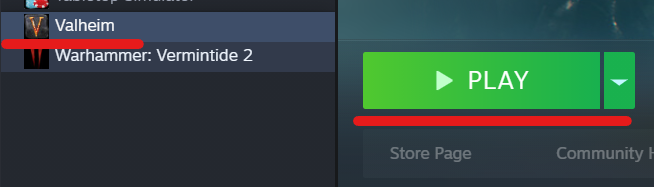
 
 
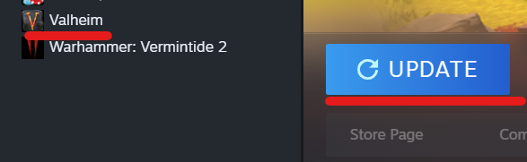
 
 

- Still in Steam, right click on Valheim and click **Properties**

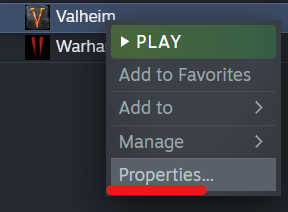
 
 

- Go to **Local Files** and click the **Browse** button. This will show you where your local **Valheim Game folder** is located. In this example, mine is stored in the C:\Program Files\SteamLibrary\steamapps\common\Valheim folder. Keep that folder location handy as you'll need to know it for later.

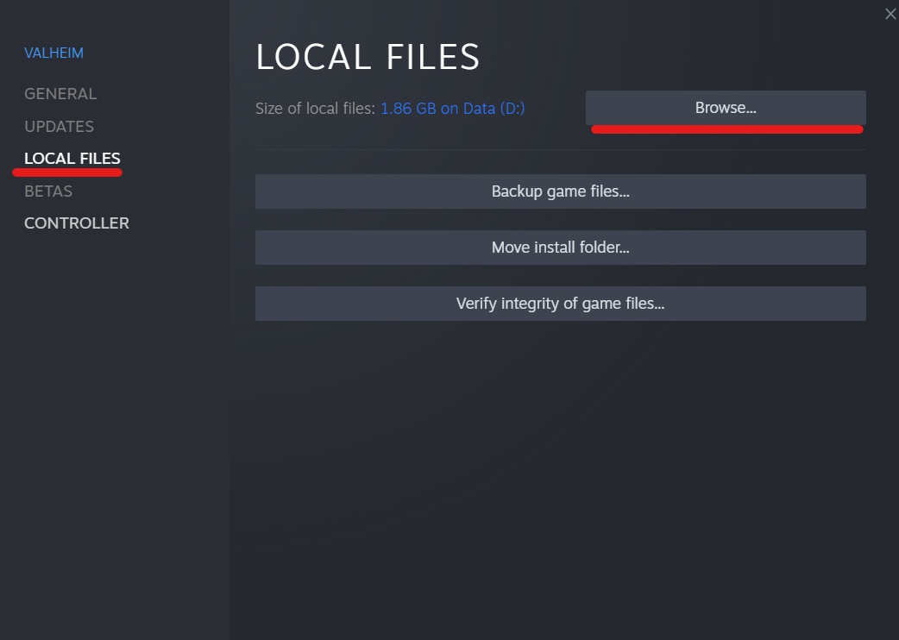
 
 
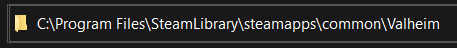
 
 

- Click on the website link here to download the needed Valheim Admin mod ZIP folder --> [Valheim Admin Mod](https://github.com/CityHallin/valheim_server/raw/main/client_mods/valheim-main.zip). 

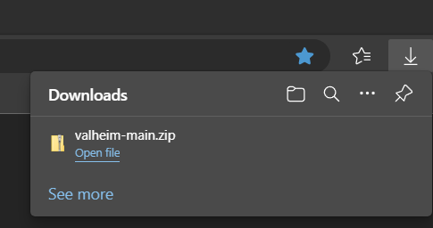
 
 

- On your local machine, go to the folder location where **valheim-main.zip** was downloaded, right click it, and select **Extract All**.

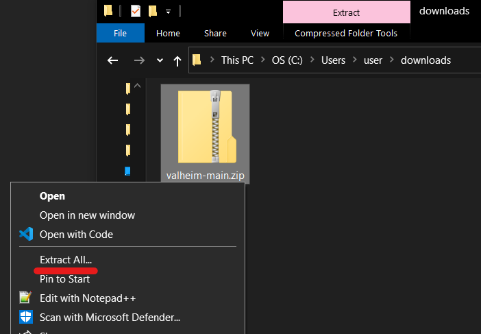
 
 

- A pop-up window will appear asking where to Extract the files. Accept the default and click **Extract**. This will create a folder valled **valheim-main** with all of the files we need inside it. 

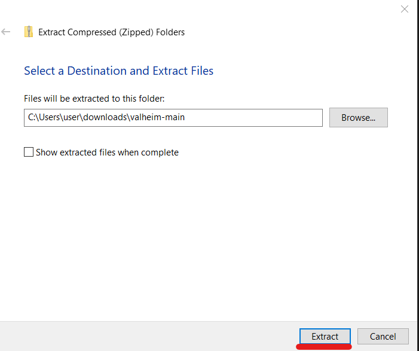
 
 

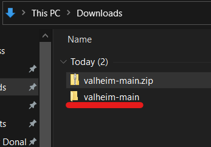
 
 

- Navigate to the new **valheim-main** folder that was just created from the extraction. There will be another folder inside called **client**. Just click into that second folder. The content of the **client** folder should have the following items
  
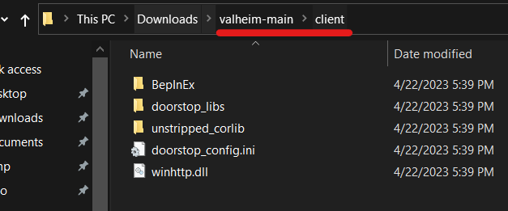
 
 

- Copy all of the files from the **client** folder to your **Valheim Game folder** you found earlier. If the copy process asks to overwrite files, select **Replace files in the destination.**

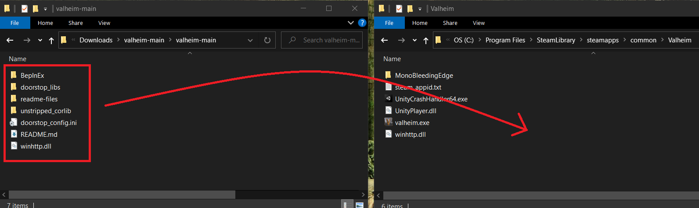
 
 

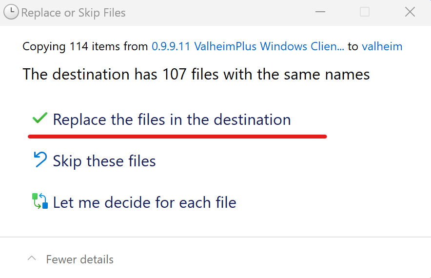
 
 

- Your local **Valheim Game folder** should have everything it needs for you to be an admin on a Valheim Dedicated Server. 

 
 

- Retrieve your SteamID. Once you have your SteamID, give this to the server admin running the Valheim Dedicated server. The server admin will need to add you to the server's admin list that will allow your user to have admin abiities on the server. 

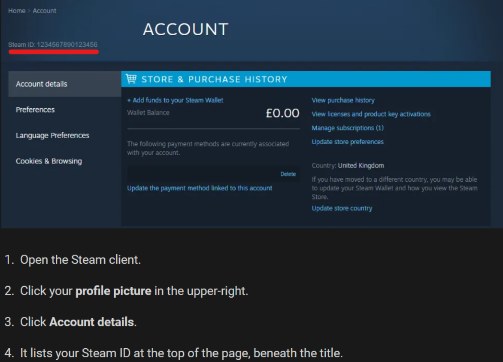
 
 

## Admin Instructions 

Once you have the Valheim Admin Mod installed on your local machine and the server admin has added your SteamID to the Valheim Dedicated Server's admin list, you can now run admin commands on that Valheim server. Here are some of the commands. 

## Get Server and Player Information

Click on the **F2** key in game to pull up server and player info. This will show you player names and SteamIDs

## Enable Dev Commands

Use the **/devcommands** command to both enable or disable admin commands. This should be enabled by default. When running this command, if it says "DevCommands: False" this means Devcommands are disabled and you need to run /devcommands to enable it. 

## Kick Players
Use the **/kick** command in the game to kick a player's character or the player's entire Steam Account. Use against the player's character name or SteamID.

## Ban/Unban Players
Use the **/ban** command in the game to ban a player's character or the player's entire Steam Account. 
 
Use the **/unban** command in the game to unban a player's character or the player's entire Steam Account. 
 
Use the commands against the player's character name to just ban the player's character. They can still join with other Valheim characters.
 
 Use the player's SteamID to ban or unban the human player's entire Steam Account from on the Valheim Server. 

## Fly
Use the **/fly** command toggle enable and disable flying ability for just your character. If you are in the air and disable fly, you will take fall damage. 
- Space bar: Character flys up
- CRTL: Character flys down

## Spawn Items
Use the **/spawn** commands to spawn items that any charcter can use. Use the following format: <i>/spawn items number</i>. Example, to spawn 10 wood use: <i>/spawn wood 10</i>
 
Here is a list of items that you can spawn --> [Item List](https://www.reddit.com/r/valheim/comments/lig8ml/spawn_item_command_list/)
