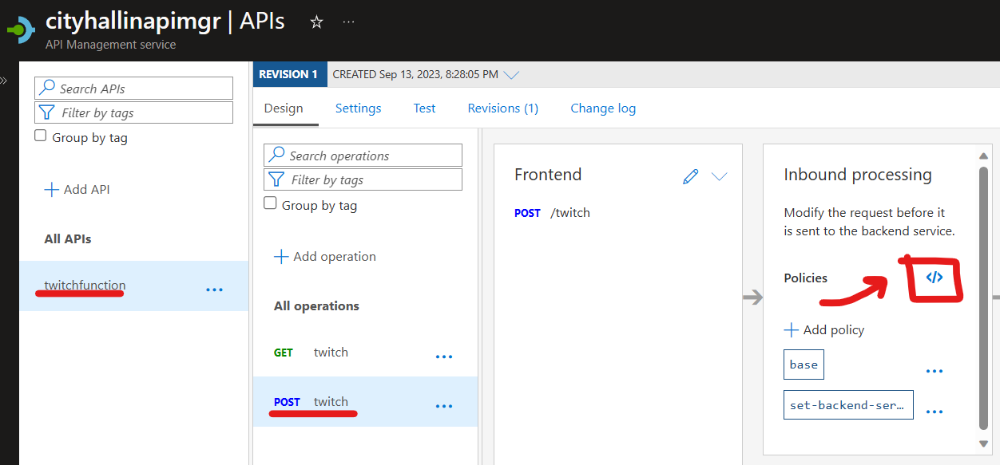

# Azure API Management Validate 3rd Party Oauth Tokens


1. [Overview](#overview)
2. [Requirements](#requirements)
3. [Project Instructions](#projectinstructions)
3. [Inbound Processing Policy Details](#policydetails)

<br />

<br />

## Overview <a name="overview"></a>
Azure API Management Services (aka APIM) can be used as a gateway service your backend APIs can sit behind. This service provides advanced features like protecting your APIs via different levels of authentication. In this example, we will be using OAuth authentication access tokens from Twitch.tv's Identity Provider to protect our backend Function App APIs. We will only allow a specific Twitch App identity to be able to submit requests to our backend APIs. This project will use manual methods for training purposes but in the future, automated deployment, Infrastructure-as-Code, and other methods can be used for more robust deployments. 

> All the Ids and Secerts in this project used as examples are no longer validate or revoked. 

## Requirements <a name="requirements"></a>
The following resources will be required for this project:
- PowerShell and installed Az modules
- Azure Resources
    - Azure Tenant and Subscription
    - Azure API Management Service
    - Azure Function App
    - Azure Storage Account (required for the Azure Function App)
- Twitch Account connected to dev.twitch.tv console
- Twitch CLI

## Project Instructions <a name="projectinstructions"></a>
- This example will be using Twitch as a 3rd-party Identity Provider. If you wish to follow along, create a [Twitch.tv](https://www.twitch.tv/) account, then browse to the [Twitch Dev Platform](https://dev.twitch.tv) and log in with your Twitch account. This is a free account and we will be using free services.

- Navigate to your [Twitch Dev Console](https://dev.twitch.tv/console/apps), navigate to the **Applications** menu, and click the **Register Your Application** button.


<br />

- Fill in the following information and click the **Create** button.
    - <u>Name</u>: this can be any display name.
    - <u>OAuth Redirect URLs</u>: Add a sinlge URL = **https://localhost:3000**
    - <u>Category</u>: Application Integration.
    - Click the check box to prove you are a human.


<br />

- Your new Twitch App will appear in the menu. Click on the **Manage** button.


<br />

- Do the following actions in this screen:
    - Click the check box to prove you're a human.
    - Click the **New Secret** button to generate a new secret for this Twitch App. Keep in mind, every time you generate a new secret, it will invalidate the old one for this App as it can only have one at a time.
    - Copy the **Client ID** and **Client Secret** from this screen. If you navigate away from this screen before copying the data, the secret will not be visible again and you will have to generate a new secret. 
    - Click the **Save** button to save everything on this screen. 
    - Treat the **Client ID** and **Client Secret** like you would a username and password so keep them safe in a password vault. 


<br />
<br />

- Next we will have to install the Twitch CLI. We will use this along with our Twitch App **Client ID** and **Client Secret** to gather access tokens and send simulated HTTP POST requests to our APIM later. Navigate to the [Twitch Dev CLI Docs](https://dev.twitch.tv/docs/cli/) for instructions on how you can download the Twitch CLI. 

- We are done with Twitch for now. We'll move on to creating Azure resources.

- Download and install the [Azure Functions Core Tool](https://learn.microsoft.com/en-us/azure/azure-functions/functions-run-local?tabs=windows%2Cportal%2Cv2%2Cbash&pivots=programming-language-powershell#install-the-azure-functions-core-tools). We will use this a little later to help create and push functions into the Azure Function App from your local machine.

- Open PowerShell and run the following command to make sure the Azure Functions Core Tool is running correctly. You should see a version number appear. You may have to re-start your PowerShell console for the changes to take effect. 
```powershell
func --version
```

<br />

- Install the PowerShell Az module set. Use the code below and select "A" when prompted. This will take several minutes. 

```powershell
Install-Module -Name Az
```

- Run the following to log into your Azure Subscription.
```powershell
Connect-AzAccount -SubscriptionName "ENTER YOUR SUBSCRIPTION NAME HERE"
```

- First, we need to create some variables our PowerShell will use during the project. I have filled these out with the entries I will use as an example, but replace these with **your own entries**. The last command will create a new Azure Resource Group for this project. 

```powershell
#Replace variables below with your own entries

#Azure Resource Group name
$resourceGroupName = "apimtest"

#Azure Region
$region = "southcentralus"

#Azure APIM instance variables. Needs to be a globally unique
$apimName = "cityhallinapimgr"
$apimOrgName = "cityhallin"

#Azure Storage Account name. Needs to be a globally unique 
#Only alphanumeric characters.
$stortageAccountName = "cityhallinapimsa"

#Azure Function App name. Needs to be a globally unique 
$functionAppName = "cityhallinapimfa"

#Creates Azure Resource Group
New-AzResourceGroup -Name $resourceGroupName -Location $region
```

11. For this project, we will create the following resources with PowerShell for ease of deployment:
    - Create a new Azure Storage Account (this will be used by the Azure Function App).
    - Create a new Azure Function App for our backend API.
    - Create a new Azure API Management Service instance.    

```powershell
#Create Storage Account
New-AzStorageAccount `
    -Name $stortageAccountName `
    -ResourceGroupName $resourceGroupName `
    -Location $region `
    -SkuName Standard_LRS

#Create Azure Function App
New-AzFunctionApp `
    -Name $functionAppName `
    -ResourceGroupName $resourceGroupName `
    -Location $region `
    -StorageAccountName $stortageAccountName `
    -Runtime PowerShell

#Create APIM
#The APIM creation make take 2-5 minutes
New-AzApiManagement `
    -Name $apimName `
    -ResourceGroupName $resourceGroupName `
    -Location $region `
    -Sku "Consumption" `
    -Organization $apimOrgName `
    -AdminEmail "admin@$($apimOrgName).com"
```
- Next, we will create the function we will use in the Function App that will act as the APIM backend API. Run the following commands which will auto-create a new function project folder with supporting files, navigate inside that project folder, and create the needed PowerShell function files. 
```powershell
#Initializes Function App Folder on your local machine
func init function_project --powershell

#Navigate into that Function Folder
cd function_project

#Create a PowerShell function inside the Function App folder using the "HTTP trigger" template
func new --name twitch --template "HTTP trigger" 
```
- Inside the .\function_project\twitch folder, you'll see a **run.ps1** file. Update this run.ps1 file with the following and save it.

```powershell
#Input bindings and base params
using namespace System.Net
param($Request, $TriggerMetadata)

#Check query for existing name property
$responseBody = $Request.Query.Name
if ($null -eq $responseBody) {
    $responseBody = $Request.Body | ConvertFrom-Json    
}

#Placeholder reply body
$body = "function-success-no-reply-body"

#Set name property from response body
if ($responseBody) {
    $body = "function-success-yes-reply-body-$($responseBody.Name)"
}

#Add body to reply output.
Push-OutputBinding -Name Response -Value ([HttpResponseContext]@{
    StatusCode = [HttpStatusCode]::OK
    Body = $body
})
```

- Make sure your PowerShell console is in the parent **function_project** directory holding all your function files. Run the following to push all of your function files to the Azure Function App. You should see the function in your Azure Function App after it completes. 
```powershell
#Navigate into the parent Function Folder
cd function_project

#Push code to the Azure Function App
func azure functionapp publish $functionAppName
```
- You should see the function in your Function App in the Azure Portal. 


<br />

- Now that our Function App is set up, we will next move to configure our APIM. In your Resource Group you created, click on the APIM you created.


<br />

- Click on the **Named Values** section in the APIM and click on the **+ Add** button. Named Values are like variables were we can add some information that we do not want to hard code in other places. 


<br />

- Create (2) Named Values. One will be used to hold the Twitch URL that we will send OAuth validation requests to (this is public data and non-sensitive). the other will be your Twitch App Client ID you saved from earlier.
```
Name: authorizer-url
Display Name: authorizer-url
Type: Plain
Value: https://id.twitch.tv/oauth2/validate
```

```
Name: twitch-client-id
Display Name: twitch-client-id
Type: Plain
Value: <ADD YOUR TWITCH APP CLIENT ID HERE>
```

<br />

- Navigate to the **Products** section in APIM and click on the **+ Add** button.


<br />

- Enter only the following information and click the **Create** button. 
```
Name: twitchproduct
Id: twitchproduct
Description: Twitch API Product
Published: Checked
Requires subscription: Unchecked
Requires approval: Unchecked
Subscription count limit: BLANK
Legal terms: BLANK
APIs: Do not do anything with this
```

- In APIM, navigate to the **APIs** section. Click on the **+ Add API** and select the **Function App** Tile. 


<br />

- Click on the **Full** slider at the top. Click the **Browse** button to find the Function App and **twitch** function you created earlier. Fill in the other fields with the details below and click the **Create** button. 
```
Display Name: twitchfunction
Name: twitchfunction
Description: Leave as default text
API URL suffix: api
Tags: BLANK
Products: twitchproduct
Version this API?: unchecked
```


<br />

- You will need the URL for your APIM API in order to test this a little later. In your **twitchfunction**, click on the **POST  twitch** operation, click on **Test**, and grab the function URL from the **Request URL** field.


<br />


- Inbound Processing Policies allow your APIM to process incoming requests with a number of different tasks and functionality. In this project, we will be using these policies to take an incoming HTTP POST request from our simulated Twitch App, extract its Authorization Oauth bearer access token, send the token to Twitch to validate, receive a response back from Twitch if the token is valid or not, and for valid tokens make sure the token is only from our Twitch App's Client_ID which will be passed to our backend Function App. 

- In your new **twitchfunction** API, by default, two operations will have been created; **GET** and **POST**. For this project we will be just using **POST**. Click on the **POST twitch** operation. Then in **Inbound Processing** click on the **Policies** icon. 


<br />

- An empty policy template will display by default. Remove all base template information, copy the information from the code block below and paste it into the policy window.
```
<policies>
    <inbound>
        <base />

        <!--Set backend Function App-->
        <set-backend-service id="apim-generated-policy" backend-id="cityhallinapimfa" />

        <!--Check response's Authorization header bearer token against 3rd party Identity Provider-->
        <send-request mode="new" response-variable-name="response" timeout="10" ignore-error="false">
            <set-url>{{authorizer-url}}</set-url>
            <set-method>GET</set-method>
            <set-header name="Authorization" exists-action="override">
                <value>@(context.Request.Headers.GetValueOrDefault("Authorization"))</value>
            </set-header>
        </send-request>

        <!--Verify 3rd party Identity Provider status 200-->
        <set-variable name="twitchcheck" value="@(((IResponse)context.Variables["response"]).StatusCode.ToString())" />
        <choose>
            <when condition="@((string)context.Variables["twitchcheck"] != "200")">
                <return-response>
                    <set-status code="401" reason="Forbidden Null or Unauthorized Twitch Token" />
                </return-response>
            </when>
        </choose>

        <!--Verify 3rd party access token client_id matches requirements-->
        <set-variable name="clientcheck" value="@(((IResponse)context.Variables["response"]).Body.As<JObject>()["client_id"].ToString())" />
        <choose>
            <when condition="@((string)context.Variables["clientcheck"] != "{{twitch-client-id}}")">
                <return-response>
                    <set-status code="403" reason="Forbidden Twitch Token" />
                </return-response>
            </when>
        </choose>
        
    </inbound>
    <backend>
        <base />
    </backend>
    <outbound>
        <base />
    </outbound>
    <on-error>
        <base />
    </on-error>
</policies>

```
- Before saving this policy, make sure to update the following policy part with your Azure Function App Name.


<br />

- Click the **Save** button once the data is copied and your Azure Function App Name added to the correct part of the policy. A break down of this policy is available in the **Inbound Processing Policy Details** section.


<br />

- We are ready to test our APIM. Open a PowerShell Window. Type in the following to configure your Twitch CLI with your Twitch **Client ID** and **Client Secret** you acquired earlier. It will prompt you to paste each value. Once this configuration is done, we will be able to create Twitch OAuth access tokens. 
```powershell
PS C:\> twitch configure

Client ID: <ADD YOUR TWITCH APP CLIENT ID HERE>
Client Secret: <ADD YOUR TWITCH APP CLIENT SECRET HERE>
Updated configuration.
```
- Type in the following to create a Twitch OAuth access token. Remember to save your **Client ID**, **Client Secret**, and **Access Token** somewhere safe like a password vault as these are sensitive pieces of data. Twitch OAuth access tokens do have an expiration time. 

```
PS C:\> twitch token

2023/09/13 20:54:07 App Access Token: sdrz2srehcvsfvneusujgedxrtloz1
```
- We will now send an HTTP POST request to the APIM using a small PowerShell script that will simulate this request coming from our Twitch App. The first request may take a few seconds as the Function App spins up for the first time. 
```powershell
#User prompts
$apimURL = Read-Host "Enter the APIM API URL"
$token = Read-Host "Enter the Twitch OAuth Access Token" -AsSecureString

#Create HTTP header
$header = @{    
    'Authorization'="Bearer $(ConvertFrom-SecureString $token -AsPlainText)"   
}

#Create HTTP JSON body
$body = @{
    name="testpostmessage"
} | ConvertTo-Json

#APIM send HTTP POST
Invoke-RestMethod `
    -Method POST `
    -Uri $apimURL `
    -Headers $header `
    -Body $body

```
- If everything was successful, you should get the following output showing the function ran and will display your "testpostmessage" message at the end of the string. 

```
function-success-yes-reply-body-testpostmessage
```
- To test if the Twitch OAuth policy is working, run the following Twitch CLI command with your access token to revoke the access token so it will become invalid. 
```
PS C:\> twitch token -r sdrz2srehcvsfvneusujgedxrtloz1

2023/09/13 21:14:51 Token sdrz2srehcvsfvneusujgedxrtloz1 has been successfully revoked.
```
- Run the HTTP POST PowerShell script above again with the same token that has now been revoked. You should get a **401** message showing Twitch did not accept it. 

```
Invoke-RestMethod: Response status code does not indicate success: 401 (Forbidden Null or Unauthorized Twitch Token).
```
- If we enter another Twitch App's legitimate access token (that uses a different Twitch App Client ID), a **403** error should appear since this legit access token was not made from our Twitch App's Client ID. 
```
Invoke-RestMethod: Response status code does not indicate success: 403 (Forbidden Twitch Token).
```
- You have completed this project and demonstrated how to protect backend APIs using 3rd-party Identity Providers. Make sure to remove and revoke any Azure and Twitch resources you will not need anymore. 


## Inbound Processing Policy Details <a name="policydetails"></a>
Below is a description of the Inbound Processing Policy used in this APIM project. 

- This policy section tells APIM to use your Azure Function App as the backend API for this APIM frontend API. 
```
<!--Set backend Function App-->
<set-backend-service id="apim-generated-policy" backend-id="cityhallinapimfa" />
```

- This section takes the incoming HTTP POST request from your Twitch App, extracts just the Authorization header that holds the Twitch OAuth Access Token, creates a new HTTP GET request, adds this extracted Authorization OAuth into its header, and sends this new HTTP Get request to the Twitch Identity Provider URL we have in the Named Value called "authorizer-url". The Twitch service will validate this OAuth access token. 
```

<!--Check response's Authorization header bearer token against 3rd party Identity Provider-->
<send-request mode="new" response-variable-name="response" timeout="10" ignore-error="false">
    <set-url>{{authorizer-url}}</set-url>
    <set-method>GET</set-method>
    <set-header name="Authorization" exists-action="override">
        <value>@(context.Request.Headers.GetValueOrDefault("Authorization"))</value>
    </set-header>
</send-request>
```

- This section receives the reply from the Twitch Identity Provider service. It than looks at the status code of that reply. A code of 200 means the access token was valid. Any other 400 series code shows there was an issue with the token's validity. Any non-200 status code replies from Twitch will force this part of the policy to cancel the request with a 401 status code back to the Twitch App. 
```
<!--Verify 3rd party Identity Provider status 200-->
<set-variable name="twitchcheck" value="@(((IResponse)context.Variables["response"]).StatusCode.ToString())" />
<choose>
    <when condition="@((string)context.Variables["twitchcheck"] != "200")">
        <return-response>
            <set-status code="401" reason="Forbidden Null or Unauthorized Twitch Token" />
        </return-response>
    </when>
</choose>
```

- This section takes the valid Twitch Identity Provider reply that had a valid 200 OK status code and compares the returned information (it returns the Client_ID of the access token Twitch validated) with the Named Value called "twitch-client-id" which holds our Twitch App's Client_ID. If the Client_IDs do not match, it will reject this process with a 403 code back to the Twitch App. 
```
<!--Verify 3rd party access token client_id matches requirements-->
<set-variable name="clientcheck" value="@(((IResponse)context.Variables["response"]).Body.As<JObject>()["client_id"].ToString())" />
<choose>
    <when condition="@((string)context.Variables["clientcheck"] != "{{twitch-client-id}}")">
        <return-response>
            <set-status code="403" reason="Forbidden Twitch Token" />
        </return-response>
    </when>
</choose>
```

- If everything passes the validations and checks above, APIM will return to is default process and forward the original HTTP POST from the Twitch App to the backend API, which in this case is our Azure Function App. The Function App will process the HTTP POST and send a HTTP reply back to the Twitch App. The rest of the code is part of the empty policy template with no data. 
```
   <backend>
        <base />
    </backend>
    <outbound>
        <base />
    </outbound>
    <on-error>
        <base />
    </on-error>
```
