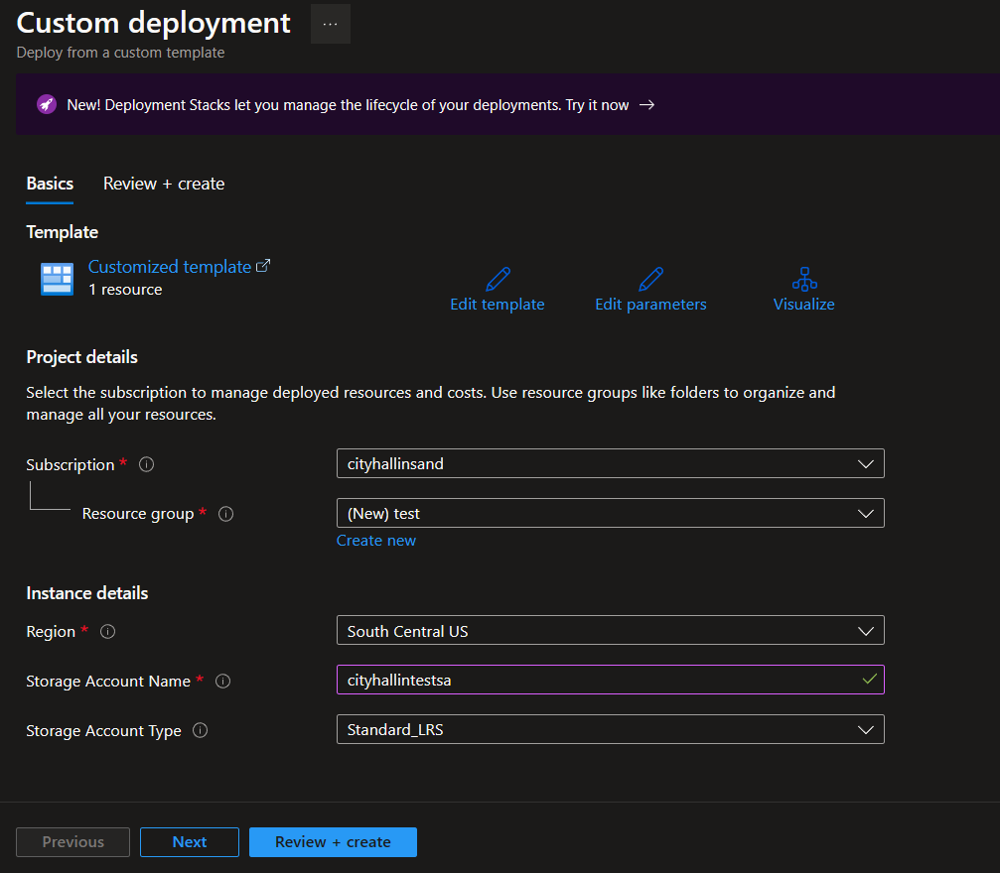

# Deploy to Azure Button

1. [Overview](#overview)
2. [Instructions](#instructions)
3. [Other Information](#other)

## Overview <a name="overview"></a>
Microsoft has a nifty feature where you can create a clickable button on your web pages or README files in order to allow the easy creation of Azure resources from ARM JSON Templates via the Azure Portal Custom Deploy portal page. 

## Instructions <a name="instructions"></a>
1. Create an ARM JSON Template of the resources you want to build. The URL of the JSON template must be publically reachable in order for the deployment button to function correctly. For this example, I will use the [template.json](https://raw.githubusercontent.com/CityHallin/public/main/resources/azure/button_deployment/templates/template.json) from my GitHub repo which has a URL that is publically reachable. 

2. The URL of the JSON template must be formatted correctly so we can create a brand new deployment URL that will work with the deployment button. In this example, use the PowerShell below to format and create the final deployment URL.
```
#Raw URL from GitHub
$rawURL = "https://raw.githubusercontent.com/CityHallin/public/main/resources/azure/button_deployment/templates/template.json"

#Format the raw URL to clean up characters
$formattedURL = [uri]::EscapeDataString($url)

#Base URL that will be used for the deployment
$baseURL = "https://portal.azure.com/#create/Microsoft.Template/uri/"

#Combined final URL that will be used for the Azure Deployment Button
$finalURL = $baseURL + $formattedURL

```
3. The final format of the URL looks like this which is a combination of the base Azure deployment prefix URL and your formatted JSON template URL:
```
https://portal.azure.com/#create/Microsoft.Template/uri/https%3A%2F%2Fraw.githubusercontent.com%2FCityHallin%2Fpublic%2Fmain%2Fresources%2Fazure%2Fbutton_deployment%2Ftemplates%2Ftemplate.json
```

4. Next, I will create a hyperlink in this README file that will reference the Azure Deployment Button from Microsoft. That button image file is located at **https://aka.ms/deploytoazurebutton**. The format is below:
```
#Format
[](FINAL DEPLOYMENT URL YOU CREATED)

#Example
[](https://portal.azure.com/#create/Microsoft.Template/uri/https%3A%2F%2Fraw.githubusercontent.com%2FCityHallin%2Fpublic%2Fmain%2Fresources%2Fazure%2Fbutton_deployment%2Ftemplates%2Ftemplate.json)
```
5. Put that all together and you should be able to click on the Azure Deployment Button below.
<br />

[](https://portal.azure.com/#create/Microsoft.Template/uri/https%3A%2F%2Fraw.githubusercontent.com%2FCityHallin%2Fpublic%2Fmain%2Fresources%2Fazure%2Fbutton_deployment%2Ftemplates%2Ftemplate.json)

6. When the button is clicked, you will be taken to https://portal.azure.com/ where you'll need to sign in with your Microsoft login that has access to your Azure Tenant. You'll be taken to the Custom Deployment page where you can select your Subscription, Resource Group, location, and any other parameters allowed by the template. Than click the **Review + Create button** to kick off the deployment. 


<br />
<br />

7. If you have other images that are publically visible with a URL, those can used as well. 
<br />

[](https://portal.azure.com/#create/Microsoft.Template/uri/https%3A%2F%2Fraw.githubusercontent.com%2FCityHallin%2Fpublic%2Fmain%2Fresources%2Fazure%2Fbutton_deployment%2Ftemplates%2Ftemplate.json)


## Other Information <a name="other"></a>
- You can save templates in an Azure Storage Account Blob and secure it with a SAS Token for more private template deployments. Review this [Microsoft Learn article](https://learn.microsoft.com/en-us/azure/azure-resource-manager/templates/deploy-to-azure-button#template-stored-in-azure-storage-account) to find out how this is possible. 

- If you've made [Azure Template Specs](https://learn.microsoft.com/en-us/azure/azure-resource-manager/templates/template-specs?tabs=azure-powershell), those can be used as well for button deployments. 
