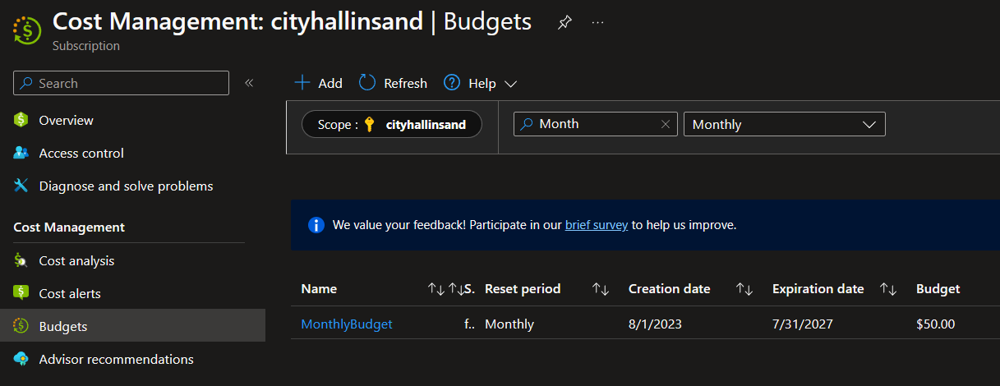

# Azure Budget and Alerts

1. [Overview](#overview)
2. [Instructions](#instructions)

## Overview 
When you create an Azure Tenant and your first Subscription, it is good to setup a Budget and Alerts to contact you when your cost are reaching a certain amount. 
> IMPORTANT: Budgets do not halt your costs if you hit the maximum amount. If you go beyond your budget, you are still responsible for costs that you accrue. 

## Instructions 
- Navigate to https://portal.azure.com and log into your Azure Portal.

- Use the search bar at the very top, search for **Budget** and click on the **Budgets** Icon. 

 
 

- Make sure the **Scope** section shows the Subscription you'd like this budget created for. Click the **Add** button toward the top to crete a new budget. 

 
 

- For this example budget, we will set it up as a monthly budget, but you have some other time frame options to choose from and can make multiple budgets.
    - Give the budget a name. In this example,. I am calling mine **MonthlyBudget**
    - Set the Reset Period to **Monthly**
    - Set the Expiration Date to a later date. If I will be using this budget for a long time, I will set it for 1-2 years in the future. 
    - Set the dollar amount you'd like this budget to be set at. For this example, I will set mine to **$50**.
    - Click **Next**.

 
 

-  Set the **Alert Conditions** section with the following types:
    - **Actual**: This is the actual cost of what you will be billed for. For this example, I will set it to **70-80%**. Azure will alert you when your charges get to this percentage so you'll know if you need to adjust any Azure resources. 
    - **Forecasted**: Based on what you build in Azure during the month, Azure will try and predict what your ending bill will be for the month. In this example, I set this to **100%**. If Azure earlier in the month thinks my bill will get to my max budget amount, it will notify me. 
- In the **Alert Recipients (email)** section, add the email addresses you wish to get notifications when the alert conditions above are met. 
- Click Create

 
 

- You should now see your budget in the budget list. 

 
 
