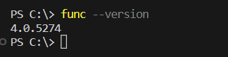

# Azure IoT Button Project

1. [Overview](#overview)
2. [Requirements](#requirements)
3. [Project Instructions](#projectinstructions)
4. [Texxmo Setup](#texxmosetup)

## Overview <a name="overview"></a>
This project demonstrates how HTTP calls from IoT devices can be used to interact with Azure resources. In daily use, IoT devices can be used to trigger alerts, Azure Function Apps to perform a number of actions automatically, and really anything that can be scripted. In this project, I will be using the [Texxmo IoT Wifi button](https://www.texxmo.info/iot-buttons/) as it is just a button that sends HTTP POST calls with JSON payloads for demonstration situations. At the push of a button, it will trigger an Azure Function App that will build a simple Azure User-Managed Identity in an Azure Resource Group. This demonstration project will be using some security aspects like TLS, a simple JSON payload claim check, and access keys. In production situations, more security features can be used like certificates, network restrictions, gateways, etc. 

Feel free to copy or clone this [Public](https://github.com/CityHallin/public) Repo. Navigate to the .\public\projects\iot_button folder for sample files. All Azure Resources, access keys, etc. in this demo have already been removed or reset.


## Requirements <a name="requirements"></a>
The following resources will be required for this project:
- Physical IoT device that sends HTTP calls with JSON payloads 
- PowerShell and installed Az modules
- Azure Resources
    - Azure Tenant and Subscription
    - Azure IoT Hub    
    - Azure Function App
    - Azure Storage Account (required for the Azure Function App)


## Project Instructions <a name="projectinstructions"></a>
1. Download and install the [Azure Functions Core Tool](https://learn.microsoft.com/en-us/azure/azure-functions/functions-run-local?tabs=windows%2Cportal%2Cv2%2Cbash&pivots=programming-language-powershell#install-the-azure-functions-core-tools). We will use this a little later to help create and push functions into the Azure Function App from your local machine.

2. Open PowerShell and run the following command to make sure the Azure Functions Core Tool is running correctly. You should see a version number appear. You may have to re-start your PowerShell console for the changes to take effect. 
```
func --version
```

<br />
<br />

3. Install the PowerShell Az module set. Use the code below and select "A" when prompted. This will take several minutes. 

```
Install-Module -Name Az
```

4. Run the following to log into your Azure Subscription.
```
Connect-AzAccount -SubscriptionName "ENTER YOUR SUBSCRIPTION NAME HERE"
```

5. Choose an Azure region you'd like to deploy these project Azure resources into. In this example, I will be using **South Central US**. A list of US regions are below. Use your selected region for all of your deplopyments in this project to keep things simple. 

```
displayName      name
-----------      ----
Central US       centralus
East US          eastus
East US 2        eastus2
North Central US northcentralus
South Central US southcentralus
West Central US  westcentralus
West US          westus
West US 2        westus2
West US 3        westus3
```
6. First, we need to create some variables our PowerShell will use during the project. I have filled these out with the entries I will use as an example, but replace these with your own entries. The last command will create a new Azure Resource Group for this project. 

```
#Replace variables below with your own entry. 
#Azure Resource Group name
$resourceGroupName = "iot"

#Azure Region selected from above
$region = "southcentralus"

#Azure IoT Hub Instance name. Needs to be a globally unique
$iotHubName = "cityhalliniot"

#Azure Storage Acocunt name. Needs to be a globally unique 
#name no one else has. Only alphanumeric characters.
$stortageAccountName = "cityhalliniotsa"

#Azure Function App name. Needs to be a globally unique name no one else has. 
$functionAppName = "cityhallinfa"

#Creates Azure Resource Group
New-AzResourceGroup -Name $resourceGroupname -Location $region
```
7. Run the following to create an Azure IoT Hub that will be used to receive messages from your physical IoT device. The name of the Azure IoT Hub must be something globally unique that no one else has in use.
```
#Create Azure IoT Hub Instance
New-AzIotHub -ResourceGroupName $resourceGroupName `
 -Name $iotHubName `
 -SkuName "F1" `
 -Units 1 `
 -Location $region
```

8. Run the following to fetch the FQDN hostname of your newly created IoT Hub. Keep this FQDN hostname info as we will use it later.
```
#Gather Azure IoT Hub Info
(Get-AzIotHub -ResourceGroupName $resourceGroupName -Name $iotHubName | Select-Object -ExpandProperty Properties).HostName
```
9. Run the following to create a device profile in your Azure IoT Hub called **button1**. After it is created, you will see the new device profile in your Azure IoT Hub Device menu list. Clicking into the device will allow you to access the device keys needed for the device to authenticate to your Azure IoT Hub. Take note of the **Device ID** and its **Primary Key** as we will need these later.
```
#Create a device profile in your Azure IoT Hub Instance
Add-AzIotHubDevice -ResourceGroupName $resourceGroupName `
 -IotHubName $iotHubName `
 -DeviceId "button1" `
 -AuthMethod "shared_private_key" `
 -EdgeEnabled
```

<br />
<br />


<br />
<br />

10. Now is the time to set up your physical IoT device. Since I am using a Texxmo IoT button, I will include setup instructions for it here: [Texxmo Setup](#texxmosetup). You will most likely need the folliwing information from your Azure IoT Hub:
    - Azure IoT Hub FQDN Hostname
    - Azure IoT Hub Device ID
    - Azure IoT Hub Device Primary Key

    Make sure the IoT device sends the following JSON Payload in its HTTP POST:
```
{"claim":"12345"}
```    

11. Once your IoT button is set up, when we press that button, we need it to trigger some sort of action. For this project, we will create an Azure Function App that will perform a simple demonstration task of creating an Azure User-Managed Identity. Use the commands below to:
    - Create a new Azure Storage Account.
    - Create an Azure Function App that will use the Storage Account.
    - Setup a System-Managed Identity on the Azure Function App and assign it the Contributor role on the Azure Resource Group we created. This will be needed so the Function App can create other resources in your Resource Group.    

```
#Create Storage Account
New-AzStorageAccount `
    -Name $stortageAccountName `
    -ResourceGroupName $resourceGroupName `
    -Location $region `
    -SkuName Standard_LRS

#Create Azure Function App
New-AzFunctionApp `
    -Name $functionAppName `
    -ResourceGroupName $resourceGroupName `
    -Location $region `
    -StorageAccountName $stortageAccountName `
    -Runtime PowerShell

#Enable Managed ID on Function App
Update-AzFunctionApp `
    -Name $functionAppName `
    -ResourceGroupName $resourceGroupName `
    -IdentityType SystemAssigned `
    -Force

#Get IoT Hub Information
$iotHubInfo = Get-AzIotHub
$iotHubKey = Get-AzIotHubKey `
    -ResourceGroupName $resourceGroupName `
    -Name $iotHubName `
    -KeyName "iothubowner"

#Create app setting for IoT Hub Connection in Function App
Update-AzFunctionAppSetting `
    -Name $functionAppName `
    -ResourceGroupName $resourceGroupName `
    -AppSetting @{"iot_hub_connection" = "Endpoint=$($iotHubInfo.Properties.EventHubEndpoints.Values.Endpoint)/;SharedAccessKeyName=$($iotHubKey.KeyName);SharedAccessKey=$($iotHubKey.PrimaryKey);EntityPath=$($iotHubInfo.Properties.EventHubEndpoints.Values.Path)"}

#Add Function App Managed ID to Contributor 
#role on Resource Group
$functionAppResource = Get-AzResource -Name $functionAppName -ResourceGroupName $resourceGroupName -ResourceType "Microsoft.Web/sites"
New-AzRoleAssignment `
    -ObjectId $($functionAppResource.Identity.PrincipalId) `
    -RoleDefinitionName Contributor `
    -ResourceGroupName $resourceGroupName
```

12. Run the following commands which will auto-create a new function project folder with supporting files, navigate inside that project folder, and create the needed PowerShell function files. 
```
#Initializes Function App Folder on your local machine
func init function_project --powershell

#Navigate into that Function Folder
cd function_project

#Create A Function PowerShell inside the Function App Folder using the IoT template
func new --name iotfunction --template "IoT Hub (Event Hub)" 
```

13. Inside the .\function_project\iotfunction folder, you'll see a **run.ps1** file. Update this run.ps1 file with the following and save it. This PowerShell script is the heart of your function and actually does the work of receiveing the trigger data from Azure IoT Hub and building the Azure User-Managed Identity.

  
    **Make sure to update this script on line 19 with your Resource Group name and line 21 with your region you chose. I am using my Resource Group name of "iot" and location "southcentralus" for this example.**
```
#Parameters
param($IoTHubMessages, $TriggerMetadata)

#Check JSON request from IoT device. If this does 
#not match "12345" this script will exit immediately.
$claim = $IoTHubMessages.claim
if ($claim -ne "12345") {
    Write-Output "Claim code incorrect or not present. Script exiting"
    exit
}
Else {
    Write-Output "Claim code from IoT device matches: $claim"
}

#Create User Managed Identity
Write-Output "Creating User-Managed Identity"
$random = Get-Random -Minimum 100 -Maximum 999
$umi = New-AzUserAssignedIdentity `
    -ResourceGroupName "iot" `
    -Name "umi-$random" `
    -Location "southcentralus"

#Complete
Write-Output "User-Managed Identity created: $($umi.name)"
```
14. Inside the .\function_project\iotfunction folder, you'll see a **function.json** file. Update this function.json file with the following and save it. This tells your function to use the  **iot_hub_connection** Function App app setting we configured in a previous step so your Function App knows where to listen for its Azure IoT Hub triggers.
```
{
  "bindings": [
    {
      "type": "eventHubTrigger",
      "name": "IoTHubMessages",
      "direction": "in",
      "eventHubName": "iot_eventhub",
      "connection": "iot_hub_connection",
      "cardinality": "many",
      "consumerGroup": "$Default"
    }
  ]
}
```

15. Inside the .\function_project folder, you'll see a **requirements.ps1** file. Update this requirements.ps1 file with the following and save it. This tells your function it needs to download certain PowerShell modules that it will use.
```
# This file enables modules to be automatically managed by the Functions service.
# See https://aka.ms/functionsmanageddependency for additional information.
#
@{
    # For latest supported version, go to 'https://www.powershellgallery.com/packages/Az'. 
    # To use the Az module in your function app, please uncomment the line below.
     'Az.Accounts' = '2.*'
     'Az.ManagedServiceIdentity' = '1.*'
}
```

16. Make sure your PowerShell console is in the parent **function_project** directory holding all your function files. Run the following to push all of your function files to the Azure Function App. You should see the function in your Azure Function App after it completes. 
```
#Navigate into that Function Folder
cd function_project

#Push code to the Azure Function App
func azure functionapp publish $functionAppName
```

17. Everything should be configured. We can now test out the IoT button functionality. Navigate to your Azure Function App and click on the newly made function. 


<br />
<br />

18. In the function, navigate to **Monitor**. Select the **Logs** tab and wait for it to say Connected!


<br />
<br />

19. Physically click on the IoT button and in a few seconds data should be flowing into the Monitor console. If you see the Output, **OUTPUT: User-Managed Identity created: umi-###** this means the User-managed Identity was created succesfully and the project works!


<br />
<br />

<br />
<br />


## Texxmo IoT Button Setup <a name="texxmosetup"></a>
Setup instructions for the Texxmo IoT WiFi button. 

1. You will need the following Azure IoT Hub details that will be entered into the IoT button config. Make sure you have them ready:
    - Azure IoT Hub Hostname FQDN (Example: In this project I am using "cityhalliniot.azure-devices.net")
    - Azure IoT Hub Device Name (Example: In this project I am using device named "button1")
    - Azure IoT Hub Device Primary Key (Example: In this project I am using the Primary Key for device "button1")
    - Time Server (you can use "pool.ntp.org")
    - WiFi network name and password. This will be used by the IoT button in order to get internet access to send REST HTTP calls to Azure. 

    <br />
2. Make sure batteries are installed in the button.

3. Enter the button config mode by holding down the button on the Texxmo for 3-6 seconds until you see the light flashing orange and then release the button. The light will continue to flash orange and then will start flashing red. The red flashing lets you know the button is in config mode. In config mode, the button will start broadcasting its own WiFi network with the name format "ESP:##:##:##". On your laptop or desktop join this wireless network. You will need the following settings. 

- Navigate to IP address http://196.168.4.1. This will take you to the Texxmo button home page
- Click on the **IoT Hub Configuration** menu and enter the IoT Hub FQDN, device ID, and device key. 
- Click on the **TimeServer** menu and enter a time server
- Click on the **WIFI** menu and enter a WIFI network and password the button can use to get an internet connection
- Click on the **IP Configuration** and keep your network defaults
- Click on the **User JSON** menu and enter the JSON below. The IoT button will send this JSON data to the Azure Function. The Azure Function App will look at this JSON data and if it does not match the below code, the script will not perform any function. We use this as a very small security feature. 
```
{"claim":"12345"}
```
- Save the configuration

4. Microsoft has a tool that can be installed on your local machine to test if your IoT button is actually sending traffic called Device Explorer that can be downloaded from here: [Device Explorer](https://github.com/Azure/azure-iot-sdks/releases/download/2016-11-17/SetupDeviceExplorer.msi)

5. Once the Device Explorer is installed, start up the application. Navigate to the **Configuration** tab and enter the **Primary Connection String for the iotowner Access Policy**. This can be fetched from inside your IoT Hub > Shared Access Policies menu. This Access Policy has the correct rights to view a lot of info about your device and to do diagnostics like this. 


<br />
<br />

After that, click the Update button. 


<br />
<br />

6. In the Device Explorer, navigate to the data tab. It should show your Azure IoT Hub FQDN and device. Click on the monitor button to begin watching for traffic. Now click on your physicla IoT button and watch for traffic to be shown in the Device Explorer Data window. You should see an event show up with the JSON displays in the data window proving ytour IoT button is sending traffic to the IoT Hub successfully. 


<br />
<br />
