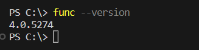
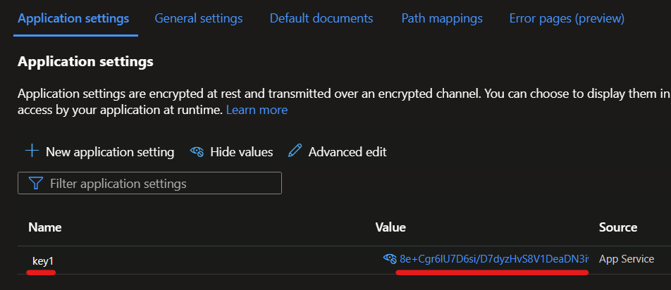
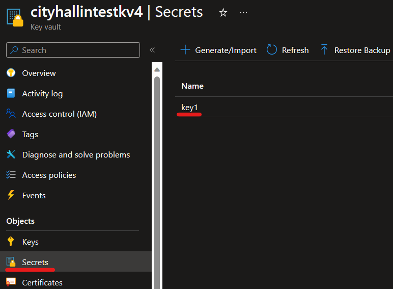
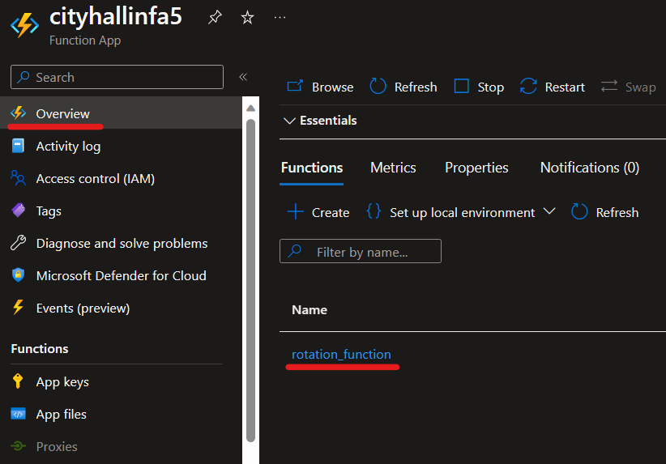
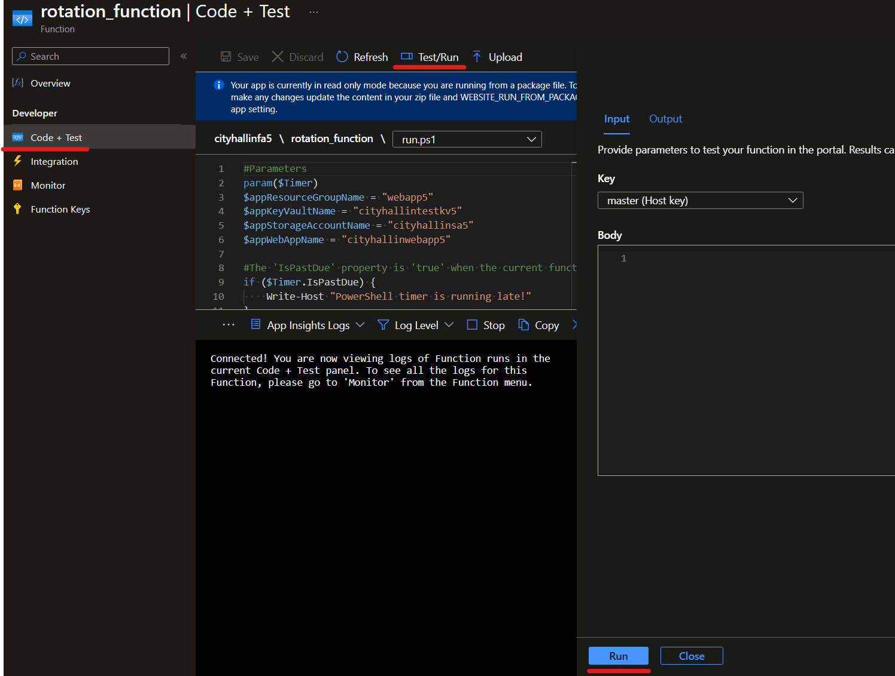
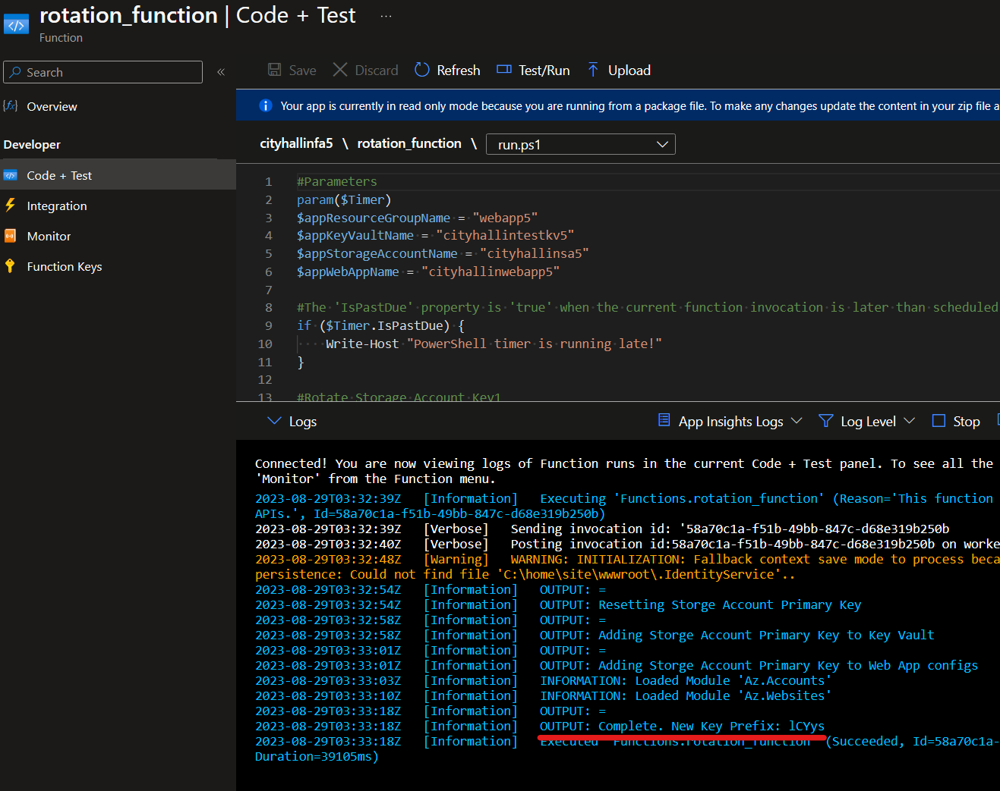
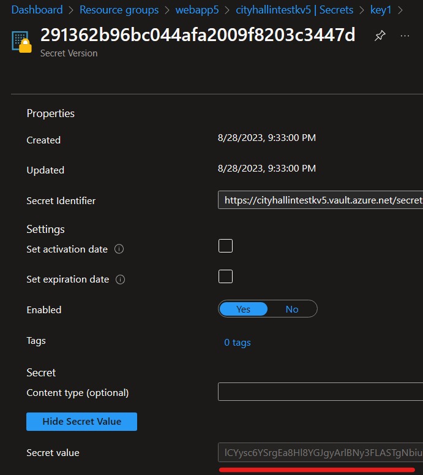
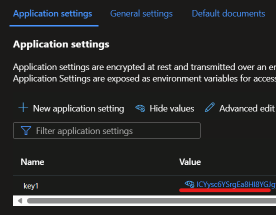

### Key Vault Secret Rotation

1. [Overview](#overview)
1. [Requirements](#requirements)
3. [Application Instructions](#appinstructions)
4. [Automation Instructions](#autoinstructions)


## Overview <a name="overview"></a>

This project example demonstrates updating secrets or keys so current versions are not used for long periods. It will also show how to update Key Vaults and the application with the new versions of secrets and keys automatically so manual effort is avoided.

In this project, we'll build the beginnings of a simple application using an Azure Web App that saves data in an Azure Storage Account. The Azure Web App saves the Azure Storage Account's access key1 in its app settings as well as a Key Vault so the Web App can access the storage. We want to change the access key on a schedule so the same key version is not used for long periods. We will use a Function App to automate updating the Storage Account key1 as well as adding the new key to the Web App and Key Vault so it can access the Storage Account.

This project is just a simple example of the process. This process can be made production ready with more advanced steps like doing primary and secondary key rotations in staggered schedules, having the application reference two sets of secrets/keys so one being upgraded at a time will not bring down the application, using SAS tokens instead of access keys, etc.

## Requirements <a name="appinstructions"></a>

- Download and install the [Azure Functions Core Tool](https://learn.microsoft.com/en-us/azure/azure-functions/functions-run-local?tabs=windows%2Cportal%2Cv2%2Cbash&pivots=programming-language-powershell#install-the-azure-functions-core-tools). We will use this a little later to help create and push functions into the Azure Function App from your local machine.

- Open PowerShell and run the following command to make sure the Azure Functions Core Tool is running correctly. You should see a version number appear. You may have to re-start your PowerShell console for the changes to take effect. 
```powershell
func --version
```

<br />

- Install the PowerShell Az module set. Use the code below and select "A" when prompted. This will take several minutes. 

```powershell
Install-Module -Name Az
```

- Run the following to log into your Azure Subscription.
```powershell
Connect-AzAccount -SubscriptionName "ENTER YOUR SUBSCRIPTION NAME HERE"
```

## Application Instructions <a name="appinstructions"></a>
- Let's first set up the example application. We'll need some variables our PowerShell will use to build our example application. Fill in these variables with the names you'd like to use. Make sure to use globally unique names for some resources.
```powershell
#General variables
$region = "southcentralus"

#Application variables
$appResourceGroupName = "webapp4"
$appKeyVaultName = "cityhallintestkv4" #must be globally unique
$appStorageAccountName = "cityhallinsa4" #must be globally unique
$appWebAppName = "cityhallinwebapp4" #must be globally unique
```
- Run the following PowerShell to perform tasks below:
    - Create an Azure Resource Group
    - Create an Azure Key Vault
    - Create an Azure Storage Account 
    - Create an Azure App Service Plan
    - Create an Azure Web App
    - Allow your user access to the Azure Key Vault secrets
    - Add Storage Account key1 as a secret in Azure Key Vault
    - Add Storage Account key1 as an app setting value in the Web App

```powershell
#Creates Application Resources
#Azure Resource Group
New-AzResourceGroup `
    -Name $appResourceGroupName `
    -Location $region

#Azure Key Vault
New-AzKeyVault `
    -VaultName $appKeyVaultName `
    -ResourceGroupName $appResourceGroupName `
    -Location $region `
    -Sku "Standard" `
    -EnableRbacAuthorization

#Azure Storage Account
New-AzStorageAccount `
    -Name $appStorageAccountName `
    -ResourceGroupName $appResourceGroupName `
    -Location $region `
    -SkuName "Standard_LRS"

#Azure App Service Plan
$appWebAppServicePlanInfo = New-AzAppServicePlan `
    -ResourceGroupName $appResourceGroupName `
    -Name "$appWebAppName-asp" `
    -Location $region `
    -Tier "Free"

#Azure Web App
New-AzWebApp `
    -ResourceGroupName $appResourceGroupName `
    -Name $appWebAppName `
    -Location $region `
    -AppServicePlan $($appWebAppServicePlanInfo.Name)

#Get info for role assignments
$loginContext = Get-AzContext
$appKeyVaultInfo = Get-AzKeyVault `
    -Name $appKeyVaultName `
    -ResourceGroupName $appResourceGroupName

#Add your user to Key Vault role assignment
New-AzRoleAssignment `
    -SignInName $($loginContext.Account.Id) `
    -RoleDefinitionName "Key Vault Secrets Officer" `
    -Scope $($appKeyVaultInfo.resourceid)

#Get current Storage Account Keys
$appStorageAccountKeys = Get-AzStorageAccountKey `
    -ResourceGroupName $appResourceGroupName `
    -Name $appStorageAccountName

#Add Storage Account key1 to Azure Key Vault secrets
$secret =  ConvertTo-SecureString -String $($appStorageAccountKeys[0].Value) -AsPlainText -Force
Set-AzKeyVaultSecret `
    -VaultName $($appKeyVaultInfo.VaultName) `
    -Name $($appStorageAccountKeys[0].KeyName) `
    -SecretValue $secret

#Add Storage Account key1 to Web App config setting
$hashtable = @{}
$hashtable["$($appStorageAccountKeys[0].KeyName)"]="$($appStorageAccountKeys[0].Value)"
Set-AzWebApp `
    -Name $appWebAppName `
    -ResourceGroupName $appResourceGroupName `
    -AppSettings $hashtable

```
- Your sample application should now be set up. The Storage Account key1 is saved in the Web App's Application Setting configuration as well as in the Key Vault as a secret.


<br />


<br />

## Automation Instructions <a name="autoinstructions"></a>
- Now that we have our sample application set up, let's work on the automation that will rotate this Storage Account key1 at scheduled times. We'll need some variables our PowerShell will use to build our automation. Fill in these variables with the names you'd like to use. Make sure to use globally unique names for some resources.

```powershell
#General variables
$region = "southcentralus"

#Application variables
$automationResourceGroupName = "automation4"
$automationStorageAccountName = "cityhallinauto4" #must be globally unique
$automationFunctionAppName = "cityhallinfa4" #must be globally unique
```
- Run the following PowerShell to perform tasks below:
    - Create an Azure Resource Group
    - Create an Azure Storage Account (required for the Function App)
    - Create an Azure Function App
    - Enabled System-Managed Identity on the Azure Function App
    - Allow the Function App's System-Managed Identity to have access to the application Key Vault, Storage Account, and Web App

```powershell
#Creates Automation Resources
#Azure Resource Group
New-AzResourceGroup `
    -Name $automationResourceGroupName `
    -Location $region

#Azure Storage Account
New-AzStorageAccount `
    -Name $automationStorageAccountName `
    -ResourceGroupName $automationResourceGroupName `
    -Location $region `
    -SkuName "Standard_LRS"

#Azure Function App
New-AzFunctionApp `
    -Name $automationFunctionAppName `
    -ResourceGroupName $automationResourceGroupName `
    -Location $region `
    -StorageAccountName $automationStorageAccountName `
    -Runtime "PowerShell" `
    -OSType "Windows"

#Enable Managed ID on Function App
Update-AzFunctionApp `
    -Name $automationFunctionAppName `
    -ResourceGroupName $automationResourceGroupName `
    -IdentityType "SystemAssigned" `
    -Force

#Get info for role assignments
$loginContext = Get-AzContext
    #automation function app info
    $automationFunctionAppInfo = Get-AzResource `
        -Name $automationFunctionAppName `
        -ResourceGroupName $automationResourceGroupName `
        -ResourceType "Microsoft.Web/sites"
    #application web app info
    $appWebAppInfo = Get-AzResource `
        -Name $appWebAppName `
        -ResourceGroupName $appResourceGroupName `
        -ResourceType "Microsoft.Web/sites"
    #application storage account info
    $appStorageAccountInfo = Get-AzResource `
        -Name $appStorageAccountName `
        -ResourceGroupName $appResourceGroupName `
        -ResourceType "Microsoft.Storage/storageAccounts"
    #application key vault info
    $appKeyVaultInfo = Get-AzKeyVault `
        -Name $appKeyVaultName `
        -ResourceGroupName $appResourceGroupName

#Add Azure Function App to Key Vault role assignment
New-AzRoleAssignment `
    -ObjectId $($automationFunctionAppInfo.Identity.PrincipalId) `
    -RoleDefinitionName "Key Vault Secrets Officer" `
    -Scope $($appKeyVaultInfo.resourceid)

#Add Azure Function App to Storage Account role assignment
New-AzRoleAssignment `
    -ObjectId $($automationFunctionAppInfo.Identity.PrincipalId) `
    -RoleDefinitionName "Storage Account Contributor" `
    -Scope $($appStorageAccountInfo.resourceid)

#Add Azure Function App to Web App role assignment
New-AzRoleAssignment `
    -ObjectId $($automationFunctionAppInfo.Identity.PrincipalId) `
    -RoleDefinitionName "Website Contributor" `
    -Scope $($appWebAppInfo.resourceid)
```
- Our automation resources are now set up. Next, we need to add some PowerShell code inside our Azure Function App that will perform the actions:
    - Update the application Storage Account key1
    - Save the new key1 to the application Key Vault
    - Save the new key1 to the application Web App
    
<br />

- Run the following commands which will create a new function project folder on your local machine with supporting files, navigate inside that project folder, and create the needed PowerShell function files.
```powershell
#Initializes Function App Folder on your local machine
func init function_project --powershell

#Navigate into that Function Folder
cd function_project

#Create A Function PowerShell inside the Function App Folder using the IoT template
func new --name rotation_function --template "Timer trigger"
```
- Inside the .\function_project\rotation_function folder, you'll see a **run.ps1** file. Update this run.ps1 file with the following and save it. This PowerShell script is the heart of your function that updates the Storage Account key called "key1" as well as saving the new key into the Key Vault and Web App.

> Update the #Parameters section of the script below with the names you used for your Azure application resources.

```powershell
#Parameters
param($Timer)
$appResourceGroupName = "ENTER RESOURCE GROUP NAME HERE"
$appKeyVaultName = "ENTER KEY VAULT NAME HERE"
$appStorageAccountName = "ENTER STORAGE ACCOUNT NAME HERE"
$appWebAppName = "ENTER WEB APP NAME HERE"

#The 'IsPastDue' property is 'true' when the current function invocation is later than scheduled.
if ($Timer.IsPastDue) {
    Write-Host "PowerShell timer is running late!"
}

#Rotate Storage Account Key1
Write-Output = "Resetting Storge Account Primary Key"
$appStorageAccountKeys =  New-AzStorageAccountKey `
    -ResourceGroupName $appResourceGroupName `
    -Name $appStorageAccountName `
    -KeyName "key1"

#Save new key1 to the Key Vault
Write-Output = "Adding Storge Account Primary Key to Key Vault"
$secret =  ConvertTo-SecureString -String $($appStorageAccountKeys.keys[0].Value) -AsPlainText -Force
$keyVaultUpdate = Set-AzKeyVaultSecret `
    -VaultName $appKeyVaultName `
    -Name "key1" `
    -SecretValue $secret

#Save new key1 to the Web App config
Write-Output = "Adding Storge Account Primary Key to Web App configs"
$hashtable = @{}
$hashtable["key1"]="$($appStorageAccountKeys.keys[0].Value)"
$webAppUpdate = Set-AzWebApp `
    -Name $appWebAppName `
    -ResourceGroupName $appResourceGroupName `
    -AppSettings $hashtable

#Complete output
$keyPrefix = $($appStorageAccountKeys.keys[0].Value).SubString(0,5)
Write-Output = "Complete. New Key Prefix: $($keyPrefix)"
```

- Inside the .\function_project\rotation_function folder, you'll see a **function.json** file. Update this function.json file with the following and save it. The schedule attribute is used to trigger this function at certain times (below is triggering this at 11:00pm on the 1st of every month). Review the Microsoft [Azure Trigger docs](https://learn.microsoft.com/en-us/azure/azure-functions/functions-bindings-timer?tabs=python-v2%2Cin-process&pivots=programming-language-powershell#ncrontab-expressions) for more information on how to set this. 
```json
{
  "bindings": [
    {
      "name": "Timer",
      "type": "timerTrigger",
      "direction": "in",
      "schedule": "0 0 23 1 * *"
    }
  ]
}
```

- Inside the .\function_project folder, you'll see a **requirements.ps1** file. Update this requirements.ps1 file with the following and save it. This tells your function it needs to download certain PowerShell modules that it will use.
```powershell
# This file enables modules to be automatically managed by the Functions service.
# See https://aka.ms/functionsmanageddependency for additional information.
#
@{
    # For latest supported version, go to 'https://www.powershellgallery.com/packages/Az'. 
    # To use the Az module in your function app, please uncomment the line below.
     'Az.Accounts' = '2.*'
     'Az.KeyVault' = '4.*'
     'Az.Storage' = '5.*'
     'Az.Websites' = '3.*'
}
```
- Make sure your PowerShell console is in the parent **function_project** directory holding all your function files. Run the following to push all of your function files to the Azure Function App. You should see the function in your Azure Function App after it completes. 
```powershell
#Navigate into that Function Folder
cd function_project

#Push code to the Azure Function App
func azure functionapp publish $automationFunctionAppName
```
- Our automation is done. To test this, navigate to your automation Azure Function App in the Azure Portal and click into your function. 


<br />

- Navigte to **Code + Test > Test/Run > Click the Run** button.


<br />

- After the run completes, if it is successful, you see the following output with the first 5 characters of the key that was changed: **Complete. New Key Prefix: #####**. The Key Vault and Web App should show this new key. 


<br />


<br />


<br />

