# Multi-Tenant Private Endpoints

An Azure Private Endpoint (PE) has the ability to span Regions, Subscriptions, and even Tenants. This readme will detail how to setup a Private Endpoint to span two of my Tenants. The idea is to have a Storage Account in Tenant1 that has a Private Endpoint in a VNET in Tenant2. This will allow resources in Tenant2 to have private network access to the Storage Account in Tenant1 without having peered networks or other coupling mechanisms. 

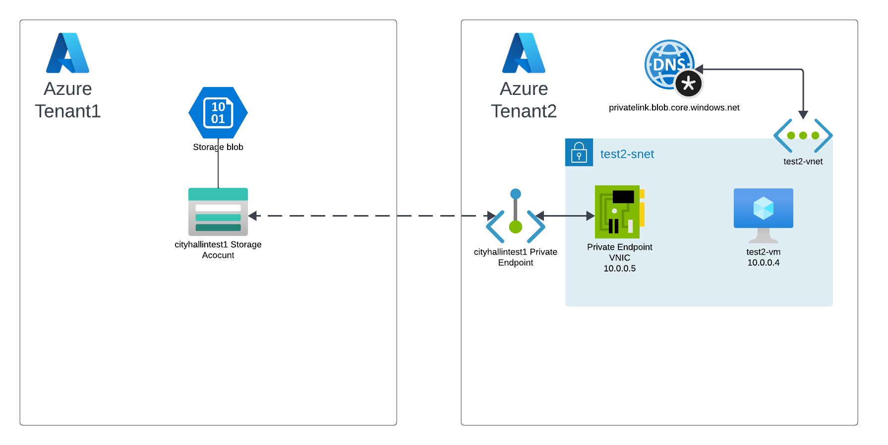
 

## Instructions

- You must have two Azure Tenants. I will be using **Tenant1**  and my **Tenant2**.

- In **Tenant1**, build the following resources in region **Central US**:
    - Resource Group: **test1**
    - Storage Account: Use a unique name for the account. I will be using **cityhallintest1**.
    - Storage Account Container: **test1**. I uploaded a smaple image file (1.jpg) into this container. 

- In **Tenant2**, build the following resources in region **South Central US**:
    - Resource Group: **test2**
    - VNET: **test2-vnet**
        Subnets: **test2-snet** and **AzureBastionSubnet** (this will be used just for the Bastion resource)
    - VM: **test2-vm**
    - Bastion: Build a basic Bastion resource using subnet AzureBastionSubnet

- In Tenant1, go to the Storage Account > Networking > Firewalls and virtual networks > Public network access and set for **Disabled**. This will stop all access in the Storage Account from its <u>public</u> interface completely. 

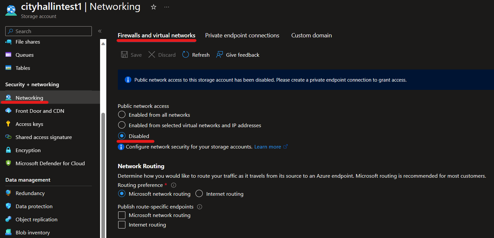
 

- In **Tenant2** > Private Links (Private Link Center) > Private endpoints, make a new Private Endpoint. 
    - Basics:
        - Resource Group: **test2**
        - Name: **cityhallintest1-pe**
        - Network Interface Name: **cityhallintest1-pe-nic**
        - Region: **South Central US**
    - Resource: 
        -  Administrators from Tenant2 will need to know the Storage Account Resource ID given to them from Tenant1 administrators. Some resources may have an **alias** (example Load Balancers) that can be used in place of the Resource ID so the subscription GUID is not exposed. 
        - Connection method: **Connect to an Azure resource by resource ID or alias.** and enter the Tenant1 Storage Account Resource ID and service (in this case blob).

        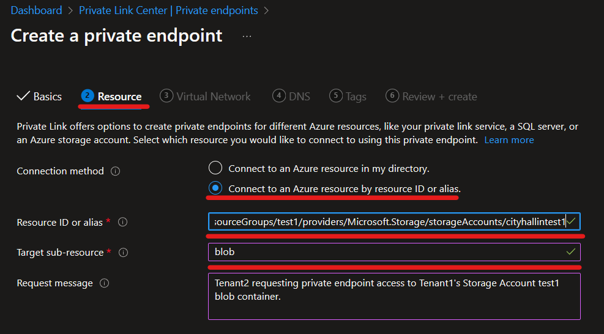
         

    - Virtual Network:
        - Set for the **test2-vnet** and **test2-snet** you created earlier. 

    - Create the Private Link resource. 

- This will send a request to Tenant1 in their Private Link Center they can approve. 

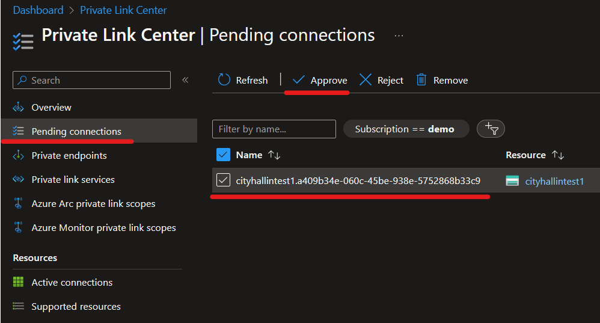
 

- Once the new Private Endpoint is approved by Tenant1 admins, the Private Endpoint will show up in the Tenant1 Storage Account.

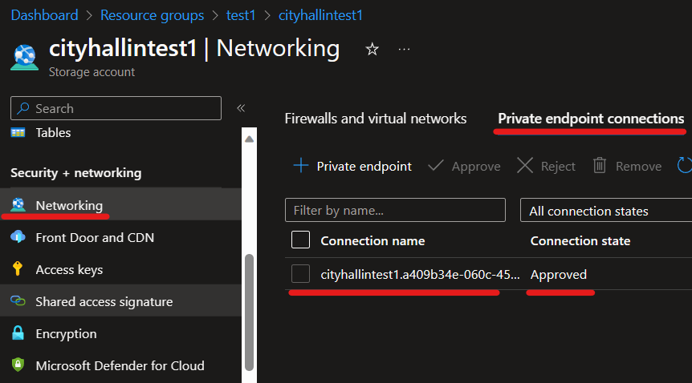
 

- In Tenant2, now that the Private Endpoint has been created, you will need to build an Azure Private DNS zone called **privatelink.blob.core.windows.net**. This will be used to create a private DNS record so assets in Tenant2 VNETs can resolve the needed Tenant1 Storage Account Private Endpoint IP and for TLS certificate requirements. 

- In **Tenant2** > Private Links (Private Link Center) > Private endpoints, go to your Private Endpoint that was made. Go to its DNS configuration and click **+ Add configuration**. Connect this Private Endpoint with the Azure Private DNS zone you just created. Doing this will automatically create the needed A record in that DNS zone for your Private Endpoint. 

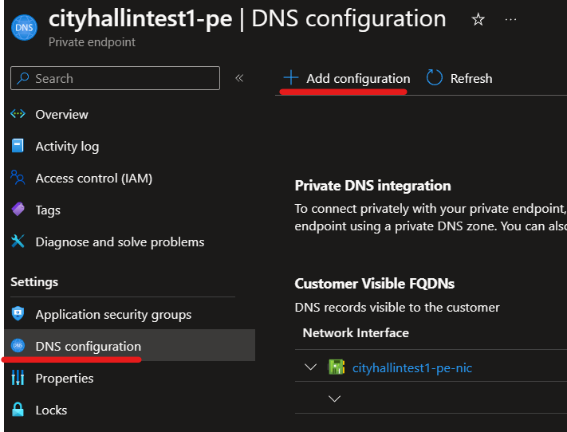
 

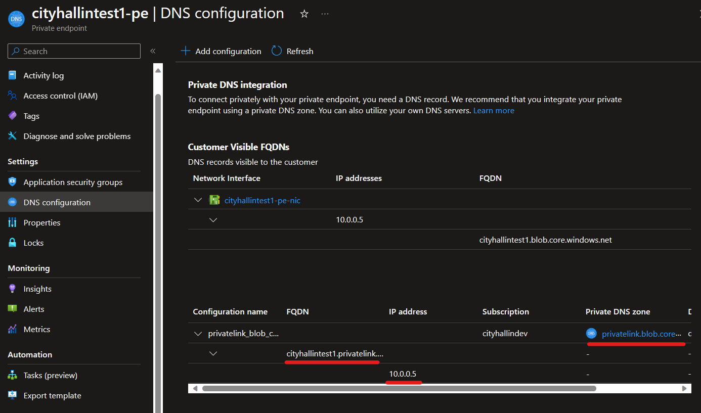
 

- After the DNS zone is created and connected to the Private Endpoint, the last step is to link this Azure Private DNS zone to the Tenant 2 VNET so the VNET will know where to send these DNS requests. Navigate to the Azure Private DNS Zone > Virtual network links and create the link from this DNS zone to your **test2-vnet**.

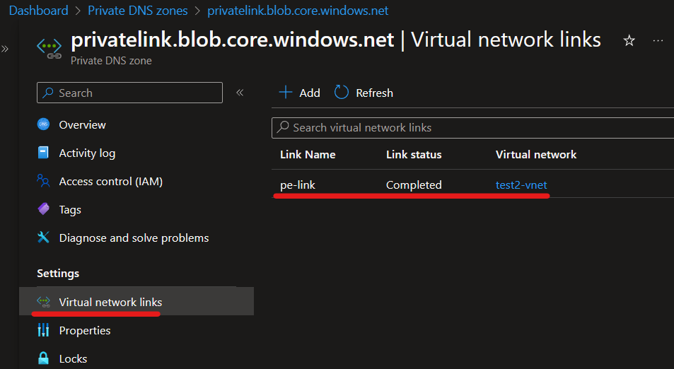
 

## Testing

- To test this access, I first try to navigate to the Storage Account blob from my regular home machine via the browser which tries to hit it via the Storage Account's public IP and is restricted. 

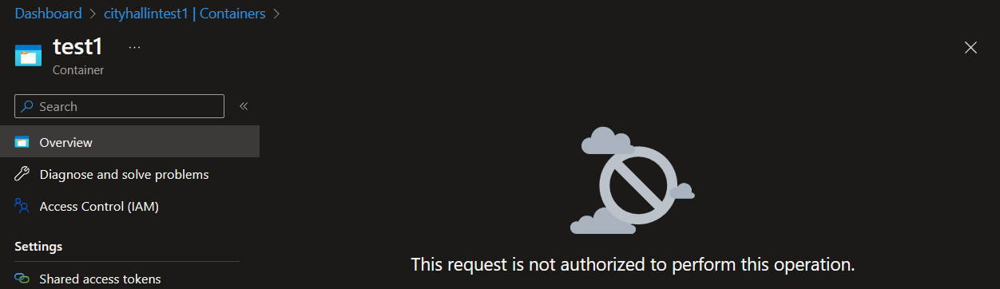
 

- Next, I Bastion into the Tenant2 VM which only has a private VNIC in the Tenant2 VNET and no public IP address. For this example, I'll just use the Azure Portal from the VM and I can access the Storage Account blob container successfully. 

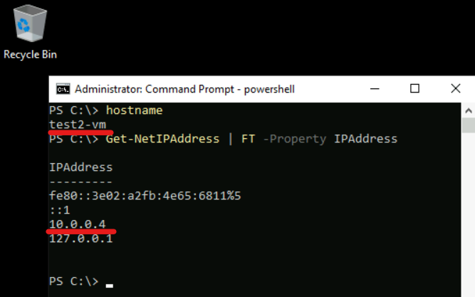
 

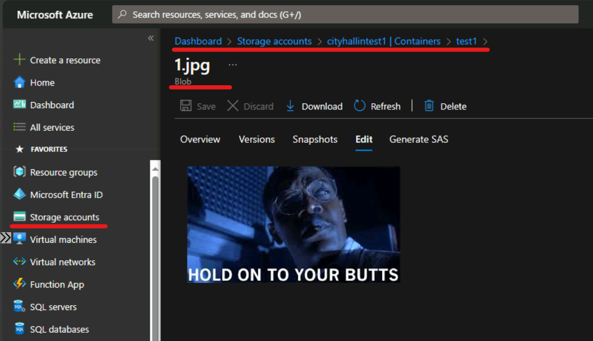
 