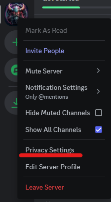

# Discord Personal User Settings

- [Discord Policies](#discordpolicies)
- [User Settings](#usersettings)
- [Billing Settings](#billingsettings)
- [App Settings](#appsettings)
- [Server Specific Privacy](#serverprivacy)
- [User Account Tips](#useraccounttips)

### Discord Policies 

- [Discord Terms of Service](https://discord.com/terms)
- [Discord Privacy Policy](https://discord.com/privacy)
- [Discord Privacy Preserving Products](https://discord.com/privacy-preserving-products)
- [Discord Community Guidelines](https://discord.com/guidelines)

### User Settings 
- My Account
    - The email account used to set up your Discord account, make sure it follows the recommendations below for secure passwords, 2FA, recovery options, etc. 
    - Verify your email address for this Discord account. 
    - Set a Discord user name that does not contain any words or phrases that may be restricted by Discord server block policies (example: sexual or profane words and terms). 
    - Use a long, secure password. Do not use words or phrases that are well known to you (example: a pet's name, your town name, etc.). It is best to use a password manager to generate a secure password for you or use a long passphrase with a mix of uppercase letters, lowercase letters, numbers, and symbols. 
    - Change your Discord password on a regular basis. Discord does not enforce this, so this will have to be a personal task. For accounts that are used for server Administration, password rotation is key to providing good security on your servers. 
    - Setup two factor authentication (2FA) on your account.
        - Save the 2FA backup codes to a secure storage area like a password manager.  If you lose your 2FA device, this will allow you to recover your account
    - Set your account up with a verified phone number. Discord does not seem to allow for virtual numbers so an actual carrier phone number will have to be used. 
    - In the future, Security Keys or Pass Keys will be allowed on user accounts which will be worth investigating. 
- Privacy and Security: Preferences Tab
    - Explicit Image Filter = Filter all direct messages
    - DM Spam Filter = Filter all direct messages
    - Allow direct messages from server members = Enable or Disable as you please, but if Enabled, it is recommended to Enable this with the setting below forcing new messages to be approved by your account first. Discord accounts used as server Administrators should have this disabled. 
    - Allow access to age-restricted servers on IOS = Disable
    - Enable message requests from server members you may not know = Enable
    - Allow access to age-restricted commands from apps in Direct Messages = Disable
    - Use data to improve Discord = Disable
    - Use data to customize my Discord experience = Disable
    - In-game rewards (aka Drops) = Disable
    - Request all of my Data = Use this feature to fetch your data Discord has for your account. This can take up to 30 days to complete. 
- Privacy and Security: Account Standing
    - Use this feature to check the standing of your account with regards to how Discord sees your account. 
- Authorized Apps
    - Check this section on a scheduled basis to review the apps you have authorized to have access to your account and what permission they hold. 
- Devices
    - Lists the devices your account is used on. You can use the **Log out of all Known Devices** button to clear your session tokens which will require you to log back into your account on your devices.
- Clips
    - Enable Clipping = Disable if you do not use this feature. While you are streaming, Discord will be continuously making small recordings in the background of your stream. 
    - Allow my voice to be recorded in Clips = Disable if you do not use this feature
- Friend Requests
    - Discord accounts that are used purely for server Administration are recommend to have these disabled. 
    - Everyone = Enable or Disable as you please. This depends on how open to new requests you'd like to be and how you intent to use Discord. 
    - Friends of Friends = Enable or Disable as you please. This depends on how open to new requests you'd like to be and how you intent to use Discord. 
    - Server Members = Enable or Disable as you please. This depends on how open to new requests you'd like to be and how you intent to use Discord.

### Billing Settings 
- Never send any of your billing accounts or billing information to anyone. 

### App Settings 
-  Accessibility
    - Always underline links = Enable. This will make hyperlinks more visible. 
- Notifications
    - Community Activity Alerts = Enable for your servers and set the alert type you wish to receive. 
- Streamer Mode
    - Enable Streamer Mode = Disable when not in use
    - Hide personal information = Enable
    - Hide invite links = Enable
    - Disable sounds = Enable
    - Disable Notifications = Enable
- Advanced
    - Developer Mode = Disable when not in use

### Server Specific Privacy 
- Even though users may default certain privacy setting in their profile, there are server-specific privacy settings that can be used toggled per server.
    - Direct Messages = Enable of Disable as you please.
    - Message Requests = Enable of Disable as you please. 
    - Activity Status = Enable of Disable as you please. 
    - Activity Joining = Enable of Disable as you please. 

 

 

### User Account Tips 
- Consider anything posted on Discord as not secure or limited with privacy regarding the Discord organization's visibility, even DMs, as end-to-end encryption is not yet a feature. The links to Discord's policies are at the top of this document for your review. 
- Be aware of friend requests or messages from users you do not know.
- Be mindful of spam or phishing attempts:
    - Free gifts
    - Server join requests you did not ask for
    - Asking for your account information
    - Social engineering attempts for other information
- Do not share passwords, access tokens, API keys, secrets, etc. 
- Be mindful of suspicious hyperlinks before clicking on them.
- Do not share personal information with anyone you do not know. 
 

[Back to Home](./discord_server_main.md)