# Discord Server Member Onboarding

- [Native Discord Onboarding](#discordonboard)
- [Bot Onboarding](#botonboard)

Below are examples of different onboarding methods that can be used to facilitate members joining Discord servers. Keep in mind, this is just the member onboarding process and not a guide to moderation inside a Discord server. An onboarding process helps create "speed bumps" that make it more difficult for automated malicious accounts and bots to enter your server, but not impossible. It also helps curate legitimate members' experiences in the server.

> Benefits: The native Discord experience is easier to set up right in your server. It also trains the user to trust Discord native features and to be mindful of malicious behavior regarding non-Discord functionality (example: some onboarding methods that use bots sent the user to a non-Discord website to sign in or get verified.)

> Trade-offs: Other onboarding methods may allow for more features and flexibility. 

## Native Discord Onboarding 

### Setup
Here is an example guide to enabling a well-rounded member onboard process using the native Discord feature set:

- On your Discord server, we want to get away from using the @Everyone role as much as possible. 

- Make a new role called **Member**. This new Member role should have all default permissions in the role set to **Deny**. This will be used for all server members as a shared role for base access. 

- Add the Member role <u>directly</u> to categories and channels you wish members to have base access to and general member abilities. 

- We will next create the non-member jail. The purpose of this is to capture Discord accounts that try to bypass the onboarding process via non-GUI methods/SDK interactions for malicious purposes. Discord accounts in this jail will not be able to see any of the member channels. This forces all accounts to use the Discord Onboarding GUI which is a speed bump for SPAM and malicious accounts that try to automate entering Discord servers bypassing the onboarding. 

    - Create a new category called **Non-Member**. Add the following permissions to this new Non-Member category:
        - Everyone
            - View Channel
            - Send Messages (do not add Read Message History)
        - Member
            - All Permissions set to **Deny**

    - In the **Non-Member** category, add **7** new channels all called **non-member(NUMBER)** (example: #non-member1, non-member2, etc.). They should inherit the categories permissions by default. We need 7 of these channels because the Discord Onboarding feature requires a minimum of 7 channels to be visible to the @Everyone group with 5 of channels allowing the Send Message permission. 

- Now go into your Discord Server Settings > Community > Onboarding > Default Channels. Set default channels to **Only**  the 7 non-member channels. Save this configuration. 

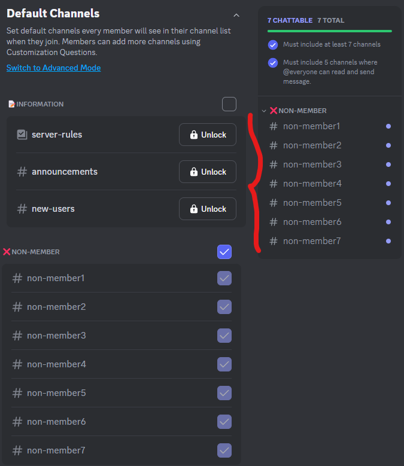
 

- Next, navigate to Discord Server Settings > Community > Onboarding > Questions. We will build a required first question that will grant the user the member role. Any other questions can be added after this, but this will be the first question. 
    - Check the box for this to be a **Required** question.
    - Question title: **Click the Become Member tile below**.
    - Set Add Answer tile to **Become Member**
    - Assign a channel category that all members should have (example: a general chat category)
    - For the role, set this to the **@Member**
    - Save this configuration.

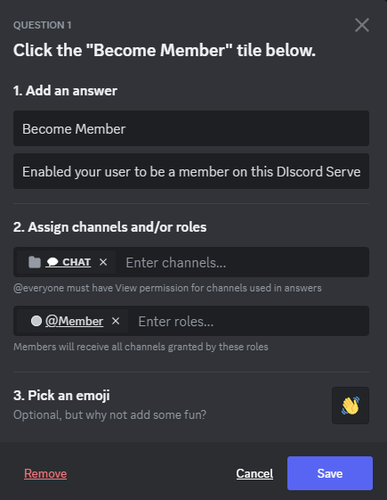
 
 

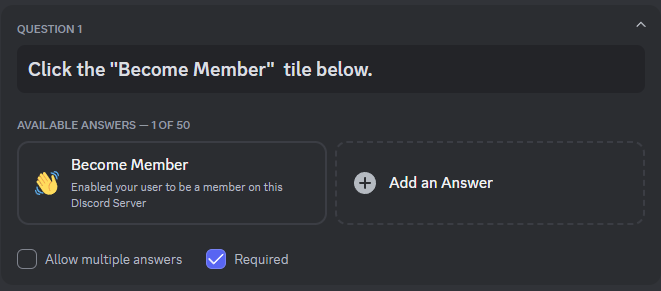
 

- Navigate to Discord Server Settings > Community > Onboarding. If all other criteria are met, **Enable the Onboarding**

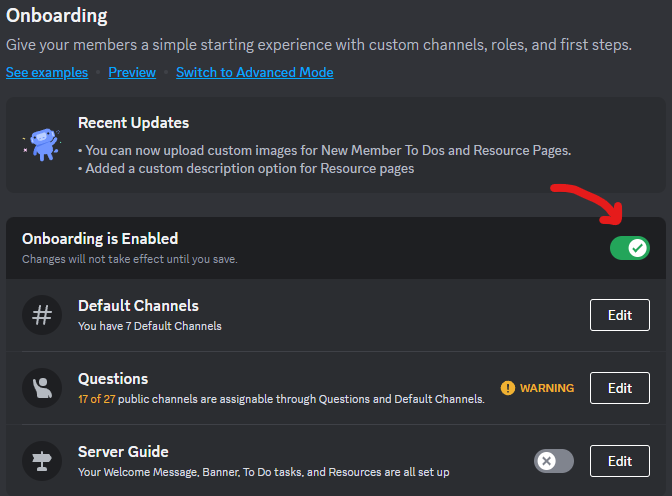
 

### Member Join Experience

- When the new member clicks on an Discord server invitation, they will automatically be taken to this server onboarding workflow. 

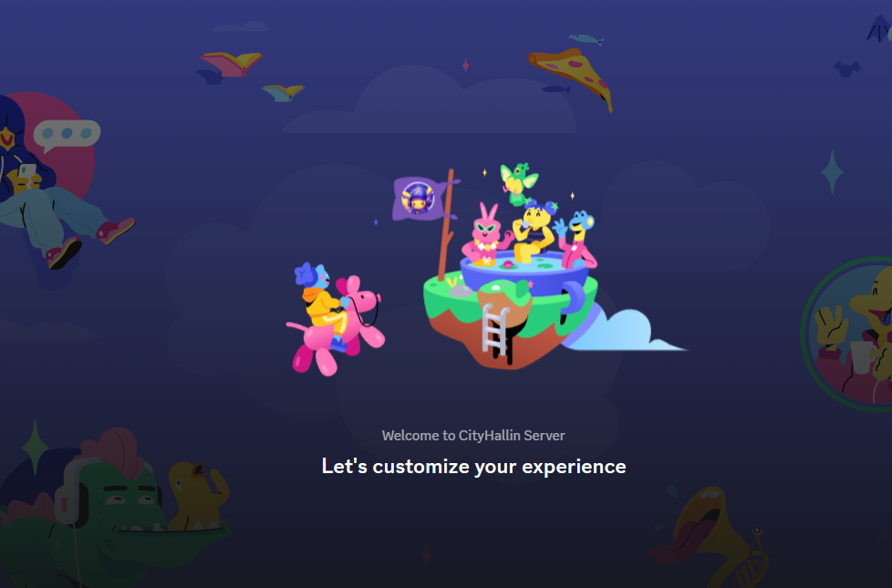
 

- The first question will only have one option for them to click on in order to continue. This will force them to go through this process in the GUI to get the **Member** Role. 

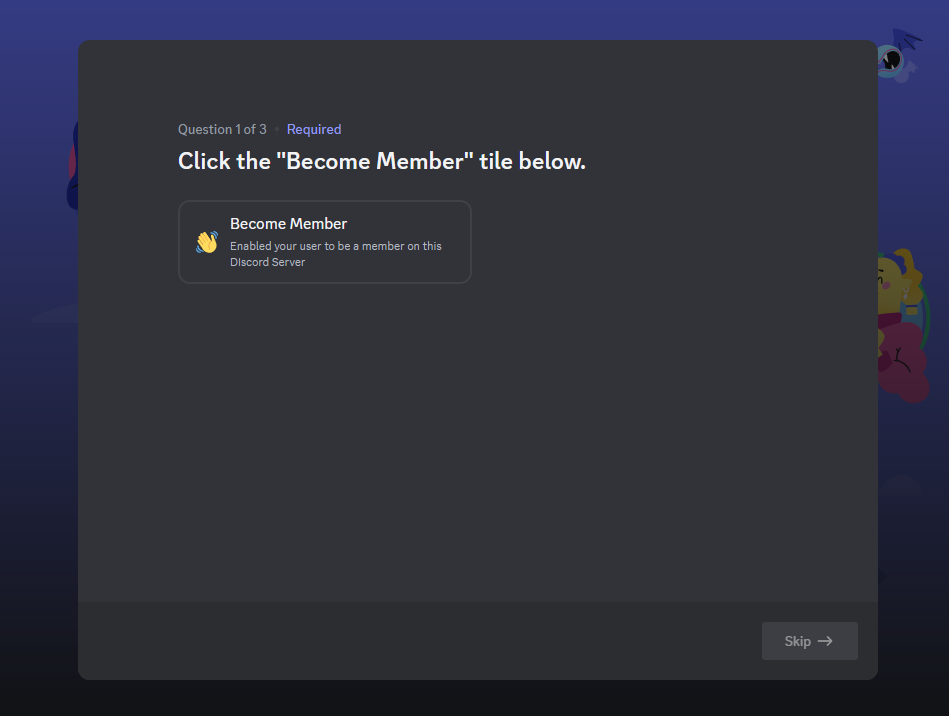
 

- If there are other questions, they will go through those. The last step will always be the review of the server rules you have configured in your **Discord Server Settings > Moderation > Safety Setup > DM and SPAM Protection > Members must accept rules before they can talk or DM setting**. The member must click **Finished** to continue into the server. 

- They will now have **Member** access in the server. 

 

### Non-Member Jail
- If a malicious user tries to enter into the server without going through this GUI-based onboarding process, they will not get the Member Role. They will be sent to the **Non-Member Jail** which only has visibility to the Non-Member channels. 

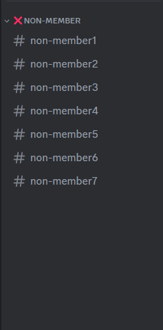
 

- The account can post in these channels, but only non-members can see it. Also the message history is turned off so each time their Discord client/session refreshes, the channel clears their history in the channel. 

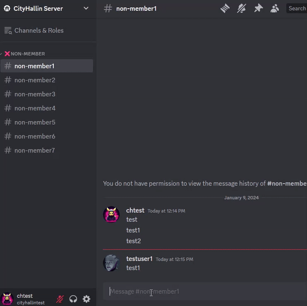
 

## Bot Onboarding 
There are many Discord Bots available that have member onboarding features. They will have their own features, set up workflow, and may be a little harder to configure. Here is a small example below using the Wick Bot onboarding and verification CAPTCHA method. 

- Entering into a server, everyone by default will only see a single channel called **#Verify-Here**. Inside that channel has a single post where the new member must click the **Verify** button to get started. Other messages will appear only the member that clicked on the verify button will be able to see. 

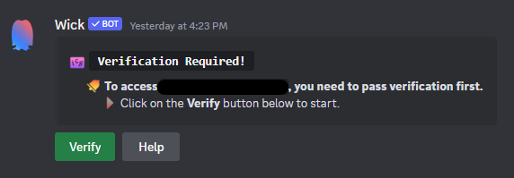
 

- A CAPTCHA will appear for the new member to complete in a time frame. 

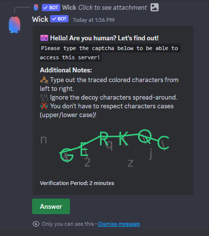
 

- Once the CAPTCHA is completed, the member will see a completion message. They will be added to some sort of Member or Verified role giving them access to the rest of the server. Normally, they will see the **#Verify-Here** channel disappear. 

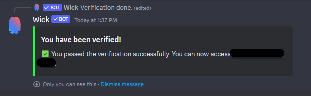
 

 

[Back to Home](./discord_server_main.md)
