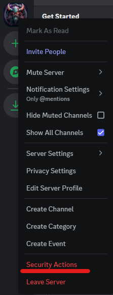
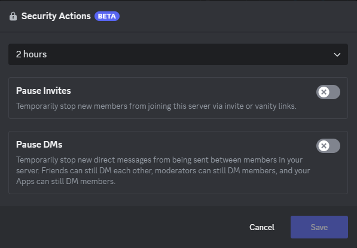

# Discord Server Management Responsibilities

- [Channel Management](#channelmanagement)
- [User Management](#usermanagement)
- [Server Management](#servermanagement)
- [Bot Management](#botmanagement)
- [Product Management](#productmanagement)
- [Moderator/Admin Tips](#modtips)
- [Monitoring](#monitoring)

Administrators and Moderators have responsibilities on Discord servers to foster an enjoyable community environment and support/protect their members. As Discord server membership gets larger, more of these best practice will be relevant, especially when monetized servers. 

## Responsibilities

### Channel Management 
- Steering user posts to appropriate channels by topic
- Management of flagged messages
- Removing messages that are against server rules or from bad actors

### User Management 
- Supporting of members experiencing issues
- Warning, kicking, user timeouts, or banning members 

### Server Management 
- Reviewing audit logs and alerts
- Troubleshooting server issues

### Bot Management 
- Use verified and well-known bots for extra functionality:
    - Member and message moderation
    - Post and announcement creation
    - Reaction roles
    - Logging and alerting
    - Server analytics
    - Monetization and product management
    - Other server or community features
- Manage and monitor bot permissions on the server
- Bot security patches and updates

### Product Management 
- If your server manages subscriptions or products:
    - Managing subscriptions
    - Product feature and uploads
    - Monetization

### Moderator/Admin Tips 
- Administrator and Moderator account passwords should not be used for any other services (passwords should be unique to this Discord account).
- Administrators and Moderators should change their passwords on a regular basis.
- Administrators and Moderators should use strong authentication like 2FA or future features like security/pass keys.
- Members that are a part of the Administrator role or have the Administrator permission set should only use that account for uncommon escalated server tasks. Those individuals should have a separate account that can be used for normal member activities or light moderation. 
- Members that become Moderators should be vetted outside of Discord or with a more personal interaction (video call, other forms of media, etc.) before being promoted to Moderators. 
- Document the processes and tasks Moderators will be performing. For example, how to kick/ban members or what to do during an malicious incident. This way, Moderators will all be completing tasks the same way.
- Discord has some features to report user accounts or harmful posts. That being said, the overall feel from Discord is Moderators are given the responsibility to govern their own Discord servers and set their own server rules accordingly.
- During a security event, servers have a new beta feature to temporarily halt member joins and DMs  over a period of time. Right click on the Discord server > Security Actions to use this feature. 

 

 

## Monitoring 
- Monitor the health of the [Discord Service Status and APIs](https://discordstatus.com/). This status service allows for multiple ways to get notified. It even allows for channel webhooks to be added which would be great for a moderator-only update channel. 
- Logging of server and administrative events from the Discord server via Audit logs. 
- User activity analytics

 

[Back to Home](./discord_server_main.md)