# Discord Server Settings and Security

- General
    - [Overview](#overview)
    - [Roles](#roles)
    - [Emoji](#emoji)
    - [Widget](#widget)
- Apps
    - [Integrations](#integrations)
- Moderation
    - [Safety Setup](#safety)
    - [Audit Log](#audit)
    - [Bans](#bans)
- Community
    - [Overview](#communityoverview)
    - [Onboarding](#communityonboarding)
    - [Server Insights](#serverinsights)
    - [Discovery](#discovery)
- Monetization
    - [Enable Monetization](#monetization)
- Member Management
    - [Members](#members)
    - [Invites](#invites)

## General

### Overview 
- System Messages Channel = Set a channel in your Information Category if used for notifications like new member joins. If anything sensitive is sent, send to a moderator-only channel.
- Send a random welcome message when someone joins this server = Enable or Disable as you please
- Prompt members to reply to welcome messages with a sticker = Enable or Disable as you please
- Send a message when someone boosts this server = Enable or Disable as you please
- Send helpful tips for server setup = Enable or Disable as you please

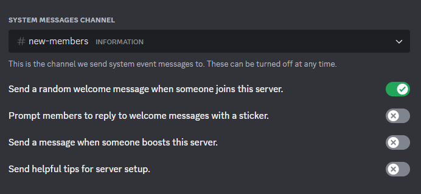
 

- Default Notification Settings = Only @mentions

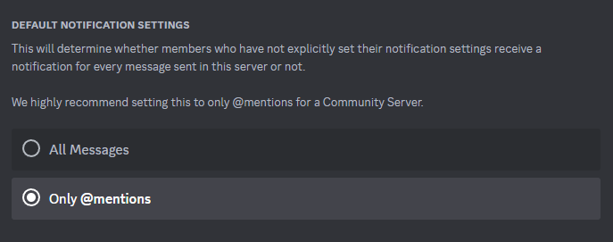
 

## Roles 
Roles on the server should have a specific purpose. Create one role for one purpose when possible. As much as you can, try to limit the use of the @everyone default role to only what is needed. 

- @everyone
    - This is a default role that comes with every server and holds all members on the server. 
    - Set the default permissions so all are disabled (including **Mention @everyone, @here, and All Roles** = disabled). This makes sure nothing is inherited where it is not supposed to be. If the @everyone role needs to be used anywhere, it will have to be set explicitly on categories or channels.  
- Administrators
    - This role normally is given full admin rights; all permissions  
    - Limit this to as few people as possible with a minimum of 2 accounts for redundancy.
    - Monitor this group membership for any rogue changes or member additions.
    - It is recommend to have a separate Discord account just for this Administrators role. That account can be logged into only when uncommon and invasive server changes need to be made like server name updates, monetization changes, community feature updates, etc.
    - Make the Administrators and all Moderator roles the same color.
    - The Administrator role should be toward the top of the role list hierarchy.
    - Display role members separately from online members = Disabled
    - Allow anyone to @mention this role = Disable
- Moderators
    - Standard moderators have the ability to do light, daily moderation tasks but limited in other capacities. This setup depends on how server Administrators wish to manage members on specific servers. 
    - This standard Moderators role should be displayed in the members list separately and members should be able to @mention them.
    - Make the Administrators and all Moderator roles the same color.
    - Display role members separately from online members = Enabled
    - Allow anyone to @mention this role = Enabled
- Advanced Moderators
    - Advanced Moderators have the same rights as standard moderators, but are allowed to do more advanced tasks as server Administrators see fit. Members that are Advanced Moderators should also be added into the Standard Moderators group as well.
    - Make the Administrators and all Moderator roles the same color.
    - Display role members separately from online members = Disabled
    - Allow anyone to @mention this role = Disabled
- Standard Members
    - If this Discord server will be placing all members in some sort of verified role via a bot mechanism or reaction role feature during server join, create a standard members role for this (example: Members or Verified). This is used to steer away from the @everyone default role and gives extra features for onboarding members in a more secure way. 
     - Set this role to have no default permissions. Permissions will need to be explicitly granted on categories or channels.
     - You may have multiple of these roles if your server has different mini-communities inside the main server. For example, one member role may be used for all members, but another role may be used for members that just want to look at gaming-related channels, etc.
     - Display role members separately from online members = Enable or Disable as you please
    - Allow anyone to @mention this role = Disable
- Feature Members
    - If you need some members to perform special tasks or have limited special permissions,  make separate feature roles for them. Examples of this would be members that can create, manage, and run events. Another would be members that can curate and manage the server emojis or sound board. 
    - Display role members separately from online members = Enable or Disable as you please
    - Allow anyone to @mention this role = Enable or Disable as you please

### Emoji 
- Allow anyone to add and use this server's emoji = Enable or Disable as you please

### Widget 
- Enable Server Widget = Disable if not in use

## Apps

### Integrations 
- Advanced Moderators and Administrators should be the only staff with this ability set by their default permissions in the roles section. 
- This section should be reviewed to make sure bots have only the required permissions needed to do their jobs, as well as only approved Webhooks created.

## Moderation

### Safety Setup 
The settings below are geared toward Discord servers that are configured as a Community Server.

- Raid Protection and CAPTCHA
    - Activity Alerts = Enabled and sending alerts to a moderator-only update channel. 
    - CAPTCHA suspicious accounts before they are able to join = Enabled
    - CAPTCHA all accounts before they can join during a suspected raid = Enabled

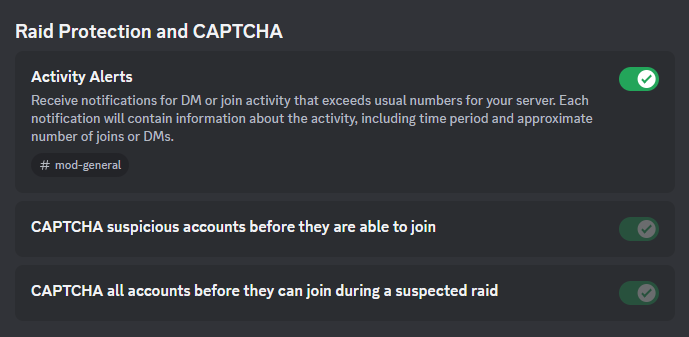
 

- DM and SPAM Protection
    - If you have a bot that is handling the member onboarding and server join process, you may disable the native Discord onboarding. Any configured onboarding process should do the following:
        - Verify the new member account.
        - Make sure the member agrees to the server rules.
        - After new members verify and accepting the rules, place the member in your Standard Members role(s).
    - Verification Level: It is recommend to set this as high as possible. The absolute lowest this ranking should be is Medium, but the more members a server has, the higher risk it will be at for spam, raids, or at worst, nuke events. Using the highest setting requiring accounts to have a verified carrier phone number attached to the account is the best verification method and is recommended.
    - Members must accept rules before they can talk or DM = Enabled. Only Disable if you have a bot handling member onboarding.
        - Set rules in this section that will be the same as rules posted in your server rules channel. When updating rules in the server rules channel, make sure they are copied here as well.
        - Depending on your Verification level, this server rules pop-up will also let members know the level of verification needed.
 
 
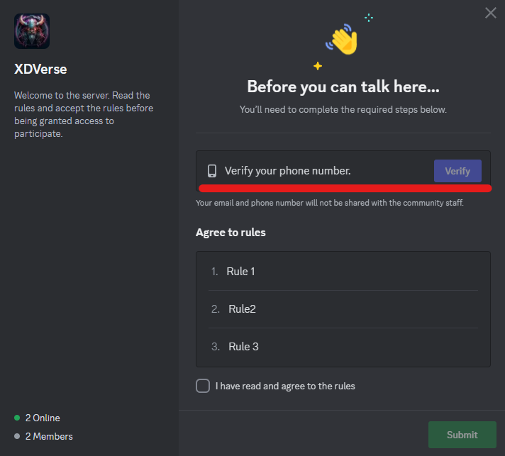
 

    - Hide DMs from suspicious users = Enabled
    - Filter DMs from unknown users = Enabled
    - Warn members before they visit outbound links = Enabled
    - Hide all messages from and deleted suspected spammers = Enabled

 
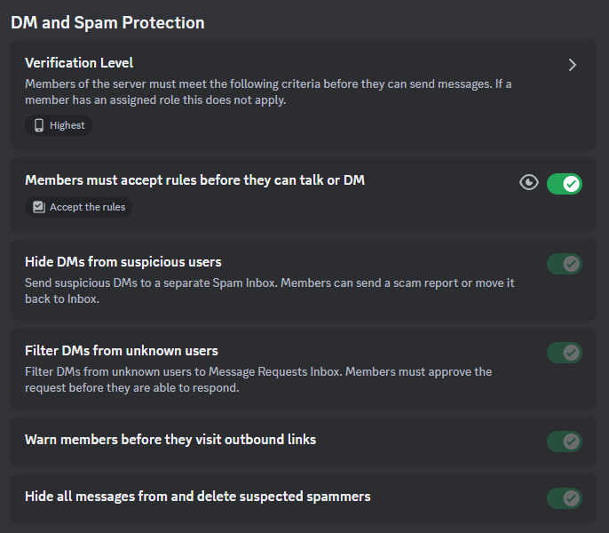
 

- AutoMod
    - Set up the AutoMod to mitigate members based on certain criteria and limited behaviors. 
    - Members: Block Words in Member Profile Names
        - Block certain words or phrases in names as you see fit. 
        - It is a good idea to set a rule that blocks standard members from creating names that mimic Administrator and Moderator member names. This will prevent bad actors trying to look like Administrators and Moderators. Add the Administrator and Moderator roles as excluded from this rule. 
        - Enable the rule to send alerts to a moderator-only channel
    - Content: Block Mention Spam = Enabled
    - Content: Block Suspected Spam Content = Enabled
        - Set up alerting to a moderator-only channel.
    - Content: Block Commonly Flagged Words = Enabled
        - Set up as you please and set alerts to go to a moderator-only channel.
    - Content: Explicit Image Filter = Filter messages from all members

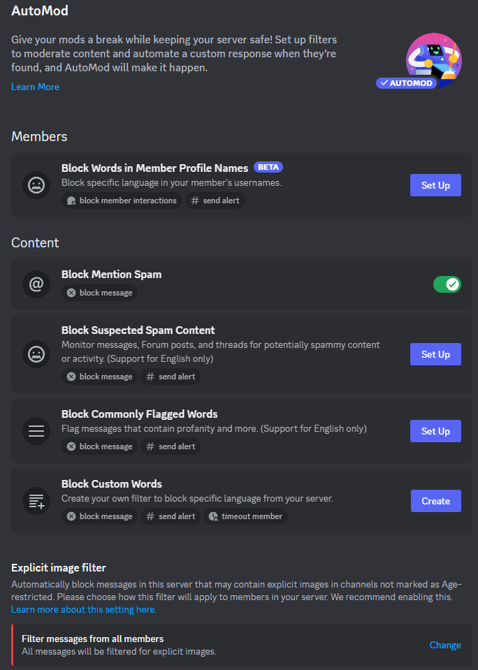
 

- Permissions
    - Require 2FA for moderation actions = Enabled
    - Remove risky permissions from @everyone = Enabled

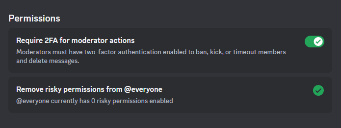
 
	
### Audit Log 
- This contains the main server logs. It is good to monitor these logs for certain server events or even better, have a system that can alert on certain events. There are bots that can help with this or admins can use the Discord SDKs to write apps that will parse and alert on logs yourself.  

### Bans 
- This is a list of banned members. When banning members, make sure to add comments when asked in the banning feature window. This will give context on why these members where banned when reviewed in the future. 

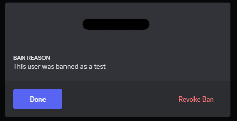
 

## Community

### Overview 
- Rules or Guidelines Channel = set to your server rules channel
- Community Updates Channel = set for moderator-only channel as this may contain server updates that are sensitive
- Safety Notification Channel = set for moderator-only channel as this may contain server updates that are sensitive
- Set server primary language = set as needed
- Add a description of what the server is for.

### Onboarding 
- The Onboarding feature is mainly for a server guide that helps new members find their way on this newly joined server. This may be disabled if you have another mechanism for guiding users around the server or another external onboarding processes.
- If you are not using an outside mechanism or bot for member onboarding, it is highly recommend to set up the native Discord onboarding to guide users around the server. 
- The Discord Onboarding will first check if your Safety Setup is at a minimal level needed for community servers and will let you know if anything needs to be changed. 

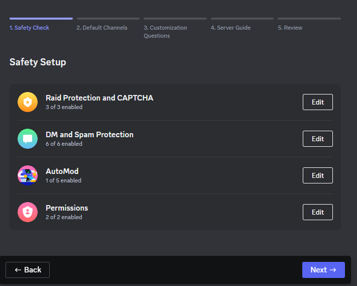
 

- The Default Channels section will allow you to set default channels members will have when they first join the server. You must have at least 7 channels with 5 channels allowing everyone on the server to read and send messages. You can choose the channels that will show up at joining, but members are allowed to hide and unhide channels that they have permissions to. This is great for larger communities where some members may only want to see certain channels and not others. 

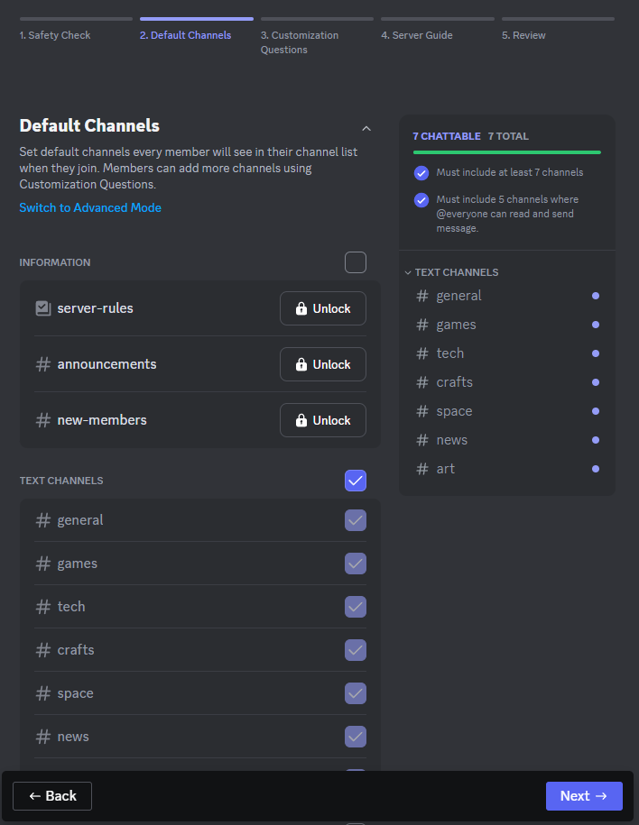
 

- Custom questions can be made to help tailor channels to members. This is optional and can be skipped if you do not need these questions. 

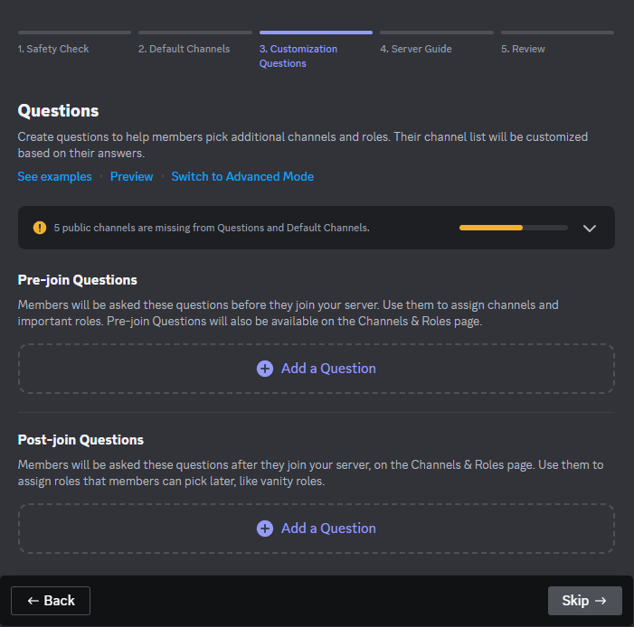
 

- The Server Guide is a feature that walks the new server members through some of your channels for things like reading rules, reviewing event channels, introducing themselves in intro channels, etc. The server guide is required for the onboarding setup, but the user will only see this after they accept the server rules and have their account checked for verification. After the member becomes a full member of the server, the server guide is available to them, but they can choose not to use it. 
    - Set up a Welcome message for new members.
    - Set up at least **3 new Member To Do** tasks that will walk the member through visiting or posting in certain channels. 
 
 
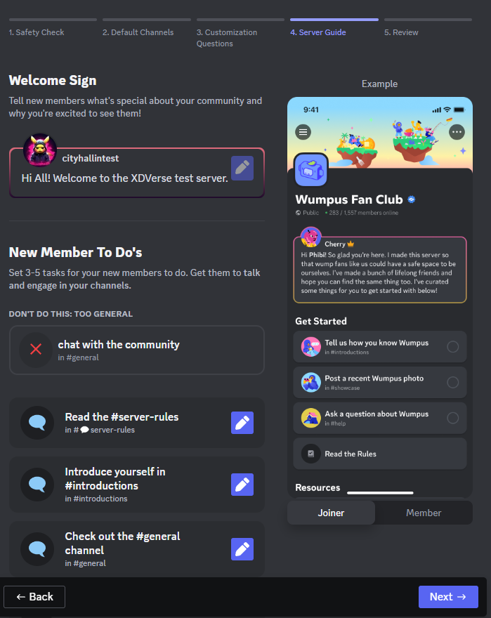
 

- The review page will show you if you missed anything. If not, click on **Enable Onboarding**.

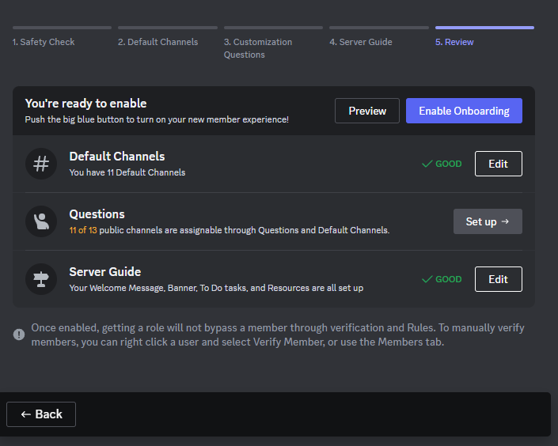
 

### Server Insights 
- Server Insights can be accessed via your [Discord Developer](https://discord.com/developers/servers) website in the Server Insights section. Your server needs a minimum number of members in order for some analytics to be visible. This feature does have some limitations. There are other verified bots that can be used for more in-depth server analytics. 

### Discovery 
- Server Administrators may allow their server to be discoverable by anyone as long as it meets certain requirements (safety configurations, over 1,000 members, age requirements, moderator configurations, etc.). Review Discord's article on the [Discord Server Discovery](https://support.discord.com/hc/en-us/articles/360023968311) feature. 

## Monetization

### Enable Monetization 
- Discord servers allow for monetization features to be built and members subscribe to those premium features or perks. If your server is enabled for monetization, Administrators and Moderators will have to manage digital projects and perks which come with their own responsibilities. When servers are monetized, this increases the attractiveness to bad actors which justifies more security and management.
    - [Discord Monetization Terms](https://support.discord.com/hc/en-us/articles/5330075836311)
    - [Discord Monetization Policy](https://support.discord.com/hc/en-us/articles/10575066024983)
    - [Discord Subscription Information](https://discord.com/serversubscriptions)

## Member Management

### Members 
- Central page for administering members.

### Invites 
- Central page for administering invites.

 

[Back to Home](./discord_server_main.md)