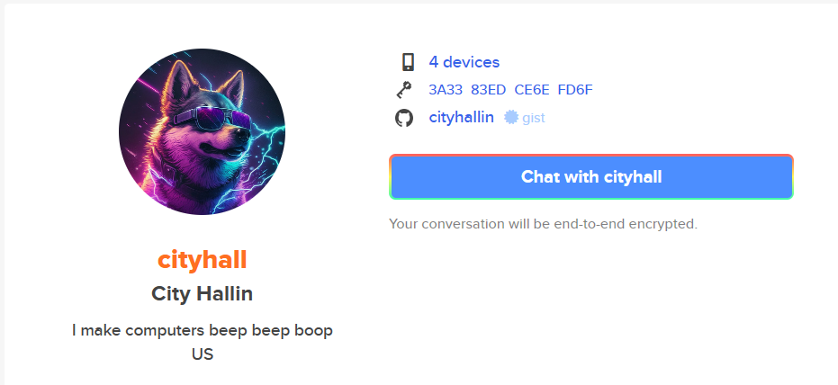

# Keybase.io

1. [Overview](#overview)
2. [I Do Have Keybase](#accountyes)
3. [I Do NOT Have Keybase](#accountno)


## Overview <a name="overview"></a>
Keybase.io is a service that centers around secure chat services, PGP messaging, and some other secure services. I mainly use it as a secure chat and PGP mesasging service. I had an older Keybase account with my full name "cityhallin", but I deleted it years ago. Keybase does not allow deleted accounts to be re-used so I had to shorten my new username to something similar for my new account. Below is my Keybase account along with my GitHub verified connection. 

- [Keybase Profile](https://keybase.io/cityhall)
- [GitHub GIST Proof](https://gist.github.com/CityHallin/2800098923cfc990c60c1625b02c447c)

## I Do Have Keybase <a name="accountyes"></a>
- If you already have a Keybase account, you will need Keybase installed on a device. If you have not done so, download and install the Keybase app from the [Keybase Install](https://keybase.io/download) page.

- Click on the **People** menu, search for my username, and click chat. 
```
cityhall
```

<br />

- Start chatting with me.


<br />

## I Do NOT Have Keybase <a name="accountno"></a>
- If you do not have a Keybase account and need to send me any private peices of data, you can use the free Keybase Encryption service. This service is not  meant for having conversations, but rather for sending single peices of data securely (like a single message, account number, passwords, etc.)

- Open a browser and navigate to the [Keybase Encryption](https://keybase.io/encrypt) page.

- In the **Recipient** section, search for and select my username below. You can click on my user's profile picture in the Recipient section to view my profile and validate the identity. 
```
cityhall
```

<br />


<br />

- Enter your text data into the **Message to encrypt** section and click the **Encrypt** button. This will convert your data into an encrypted format. 


<br />


<br />

- Copy this newly encrypted data and send it to me via other means like email, IM, etc. (example below sending it to me via Discord). My Keybase user will be the only one that has the ability to open it. 


<br />
