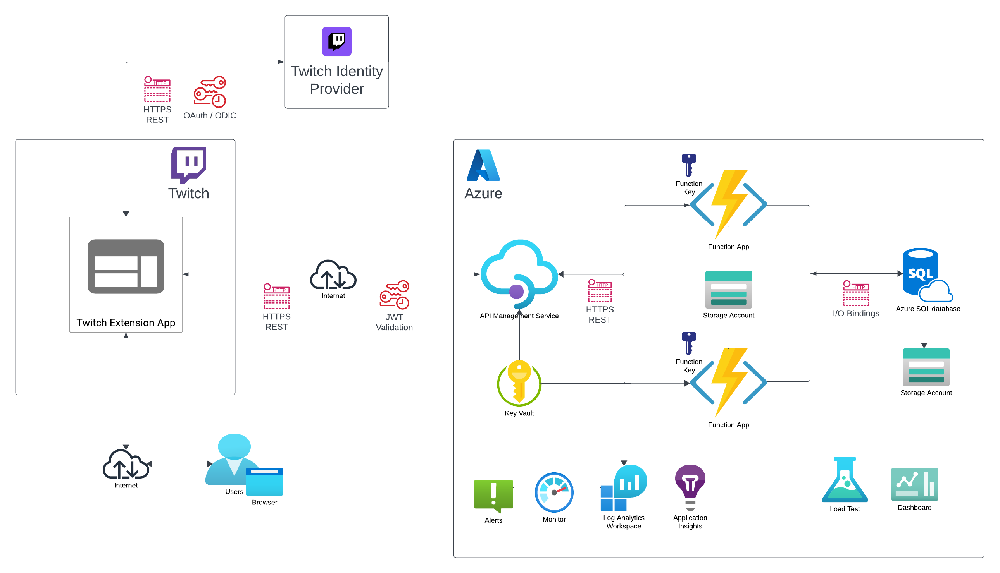

# Project Resources

- [Project Overview](./1-project_plan.md)
- [Project Resources](./2-resources.md)
- [Project Testing](./3-testing.md)

Below are the resources that will be used in this proof-of-concept project. 

## Network Diagram

 

## Resource List

### Code and Languages
- HTML / Javascript
- Node.js
- PowerShell
- SQL

### Frontend Resources

- We first need to create a [Twitch Account](https://www.twitch.tv/login) and then allow that Twitch account to access Twitch's [Developer Environment](https://dev.twitch.tv/). 

- From the Twitch Development Environment, we then create a new [Twitch Extension Application](https://dev.twitch.tv/docs/extensions/#build-your-first-extension) from your dev console. This Twitch Extension application profile sets up your configurations to allow us to development this application from our local machine, gives our application a client id and secret pair for Twitch authentication, and a place to upload application files once we are ready for hosted testing. 

- We build simple HTML and JS files that will make up the frontend Twitch Extension application.

- For local testing, we use the [HTTP-Server NPM](https://www.npmjs.com/package/http-server) package in order to serve our frontend Twitch Extension application from our local dev machines to the channel's browser-based test panel.  

### Backend Resources

- In this project, we will be using Azure for what Twitch calls EBS (Extension Backend Services). It is where the processing and heavy lifting of your application resides. By nature, Twitch Extension applications are pretty much public, so you do not want to save anything sensitive in your frontend application. I will be using the following Azure resources for the EBS services:
    - **Azure Storage Accounts**: The Storage Accounts will be used to store the Function App's files, static file storage (like images and table lists), and secondary services to support the Azure database (like stored procedure outputs, misc logs, etc.). 
    - **Azure Function Apps**: The Function Apps will house multiple functions for the following processes:
        - A function to process incoming Twitch Extensions HTTP POST requests for user answers and running CRUD operations again the Azure database.
        - A function to process users requesting leader board stats.
        - A function updating a web page that will be streamed by the presenter displaying the current question users will guess the asnwer to (this service has not been made yet).
    - **Azure API Management Service (APIM)**: The APIM will be the gateway initially receiving Twitch Extension HTTP POST requests. The APIM will provide the following functionality:
        - Proxy the backend API resources. This allows us to change the backend API service at will, without having to update the Twitch Extension application. 
        - Validation of JSON Web Tokens (JWT) from the Twitch Extension application HTTP POST requests for the purpose of locking down backend API access to only allowed Twitch Extension applications of our choosing. 
        - Provides code 429 rate limiting functionality. 
        - Provides more granular CORS policies. 
    - **Azure Key Vault**: Saves sensitive data for use by other resources. We will be storage the singing key from the Twitch Extension application that will be used to verify its JSON Web Tokens, the Twitch Extension application's client id/secret, and other pieces of data needed. 
    - **Azure SQL Database**: PaaS instance of Azure SQL that will hold dynamic data for the game status, progression, user leader data, possibly question/answer pairs, etc. 
    - **Azure Log Analytics Workspace (LAW)**: Holds the logs from all the Azure resources that can be reviewed or piped to analytical services. 
    - **Azure Application Insights**: Will be used to analyze logs from the LAW, trace logs, and performance data.  
    - **Azure Monitor and Alerts**: Will be used to track general Azure resource performance and general alerts for conditions admins need to kow about. 
    - **Azure Load Testing**: Will be used to generate simulated HTTP POST traffic to test the performance of the Azure services at different usability scales.
    - **Azure Dashboard**: Will be used to display needed information to operators. 

- The first resources we build in Azure are the Resource Group to hold the project, Log Analytics Workspace (LAW), and Key Vault (set for Azure RBAC instead of access policies). We then build the Application Insights instance (connecting it to the LAW) and Storage Accounts. Next we build the Functions Apps (connected to the one of the Storage Accounts and Application Insights instance), and the API Management Service (APIM). Make sure the Function Apps and APIM are created wth System-Managed Identities. 

- Build a new Entra ID group. This will be used for all only admins users that will need sysadmin-level access into the database. Developer users and application identities will not be in this group as they will have more least privileged roles in the database security. 

- Build the Azure SQL Database instance. It will use SQL and Entra authentication. Set the Azure AD Admin setting in the database to the Entra group created in the previous step. Set its firewall to only allow access from approved home/work IP addresses (for SSMS access) as well as Azure services. Add the SQL admin username and password to a separate Key Vault only for admin level users. 

- Populate your needed SQL tables and initial record data. 

- Run SQL commands in the Azure SQL database to add the developer Entra users and Azure Function App System-Managed Identities as users in the database and to needed database roles. 

- In the Key Vault, add the developer Entra users as well as the Function App and APIM System-Managed Identities to the **Key Vault Secrets User** Azure assignment role so they can read the needed Key Vault secrets. Set only admin users to the **Key Vault Contributor** and **Key Vault Secrets Officer** roles. 

- In the Function Apps, build the required functions for HTTP triggers and authentication set to **function**. Add the needed Azure Function App application settings and database connection strings in the Configuration section. Also add the needed SQL input and output bindings for the needed functions for the Azure SQL database.  

- In the APIM, build a new Product (not using subscription keys) and add a Named Value for the twitch singing key pointing to the singing key secret in the Key Vault. 

- Create your new APIs pointing to your functions in the Azure Function Apps. 

- Add needed CORS policies in the ALL APIs, single API, or single API operation scope depending on how CORS needs to be locked down for each API. Make sure to only allow the needed origin URLs as well as allowed headers for each API. 

- For each API that will be receiving HTTP POST requests from the Twitch Extension application, set up a validate-JWT policy that references the twitch singing key Named Value being pulled from the Key Vault. The Twitch Extension application will be set to send the JWT in an Authorization Bearer header that is signed by the Twitch Extension application's secret key. This will lock down the APIM API so it can only accept HTTP POST requests from our Twitch Extension application that was signed by our specific signing key. 

View the [Project Testing](./3-testing.md)