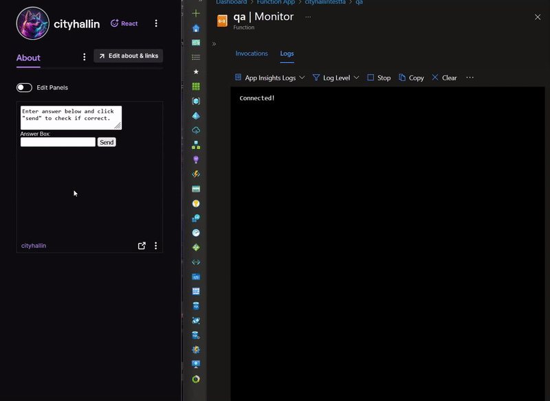
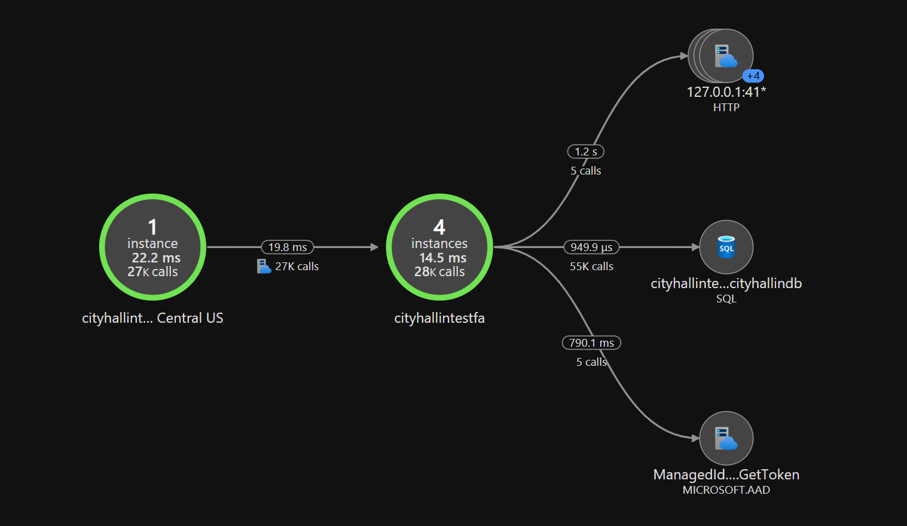
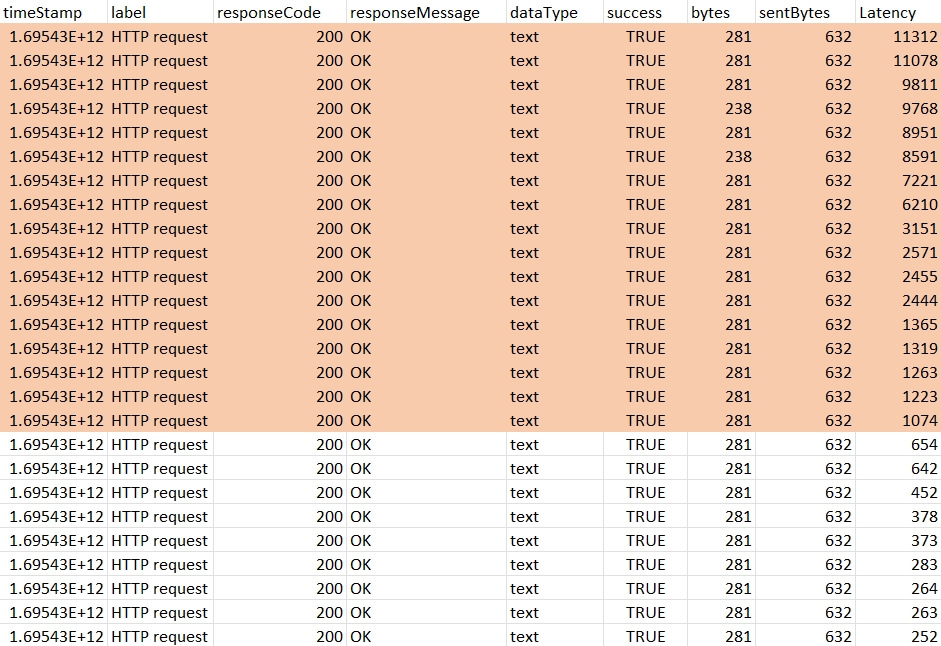
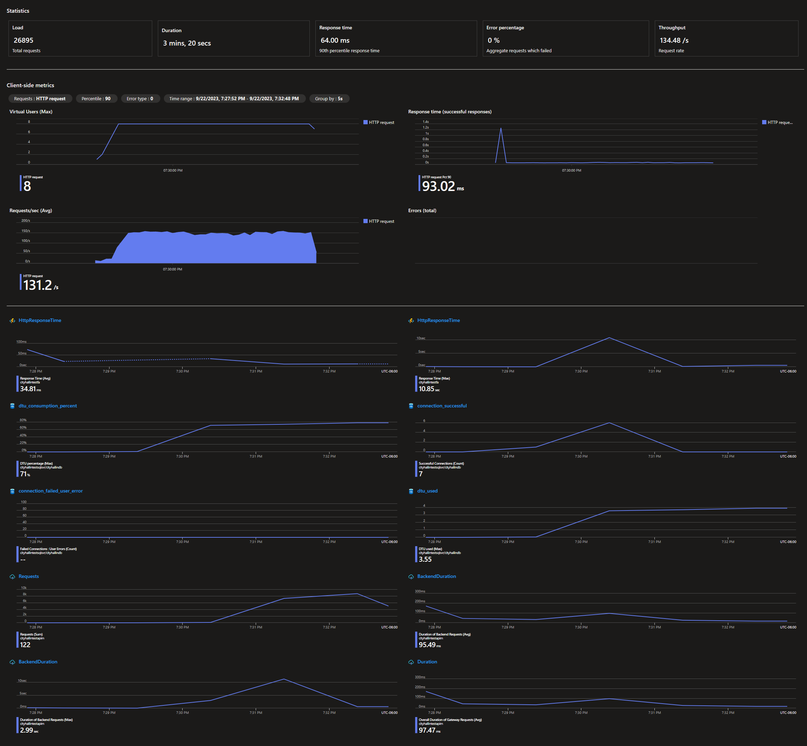

# Project Testing

- [Project Overview](./1-project_plan.md)
- [Project Resources](./2-resources.md)
- [Project Testing](./3-testing.md)

### Application Demonstration
This is a simple demonstration of the frontend application in action in a Twitch channel's panel component. The stream presenter would display a question on the stream (in this example: "How many planets are in our solar system?"). The viewer would then submit their answer. The Azure APIM validates the request and passes it to the Azure Function Apps. The functions process the answer against the SQL database and reply back with the status of the answer. 

 

### Application Flow Diagram
The below diagram shows the application flow and performance via Azure Application Insights how the requests pass through the APIM, to the Azure Function Apps, hitting the SQL database, as well as platform support from the Microsoft Identity provider for the resource's managed identities. 

 

### Load Testing
Using Azure Load Testing and JMeter configurations, we ran multiple tests on the application workflow looking at overall workflow performance and resource scaling speed. 

Out of 26,895 simulated requests sent to the workflow in 3 minutes and 20 seconds, only 17 requests had a latency over 1 second (ranging from 1 - 11.3 seconds). This made up only .06% of the traffic. This could be caused while scaling operations are happening for the Azure resources, the caching from the database and APIM could be resetting, or something with the Azure Load Testing scaling caused these packets sets to be slow. 

With such a small fraction of traffic suffering this latency, we decided this impact was acceptable in its current form. Subtracting the 17 large latency requests, the average latency for the rest of the test was only ~52 ms. The test was conducted from Azure's East US 2 region and the project resources are in South Central US. 

 

 

